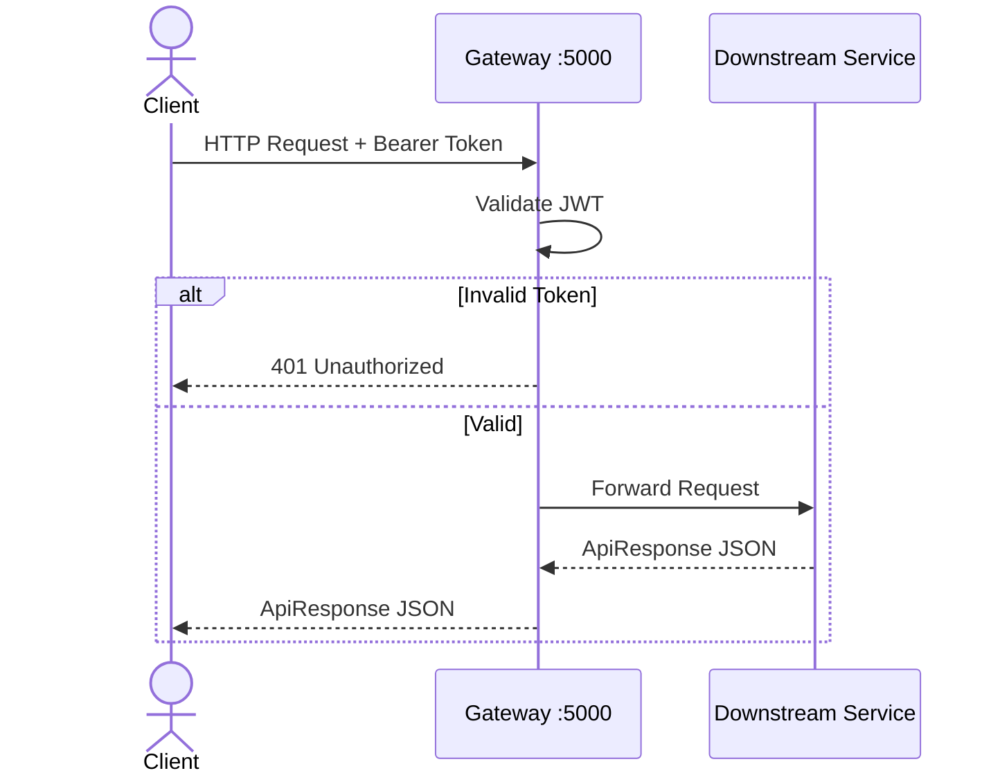
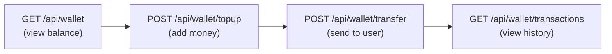
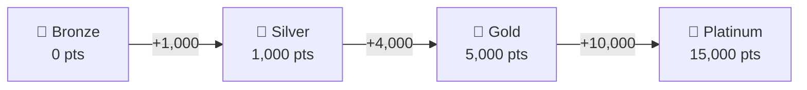
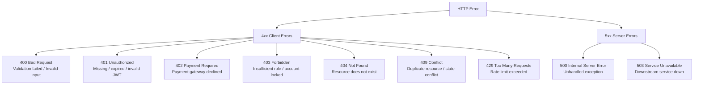

# API Documentation — Digital Wallet

**Base URL:** `http://localhost:5000` (via API Gateway)  
**Authentication:** JWT Bearer Token (except public endpoints)  
**Content-Type:** `application/json`  
**API Version:** v1

---

## Table of Contents
1. [Authentication](#1-authentication)
2. [OTP](#2-otp)
3. [KYC](#3-kyc)
4. [Wallet](#4-wallet)
5. [Rewards](#5-rewards)
6. [Notifications](#6-notifications)
7. [Admin — KYC Management](#7-admin--kyc-management)
8. [Admin — Dashboard](#8-admin--dashboard)
9. [Admin — Rewards Catalog](#9-admin--rewards-catalog)
10. [Support Tickets — User](#10-support-tickets--user)
11. [Support Tickets — Admin](#11-support-tickets--admin)
12. [Standard Response Schemas](#12-standard-response-schemas)
13. [Error Codes Reference](#13-error-codes-reference)

---

## API Flow Overview



---

## 1. Authentication

**Downstream Service:** Auth Service  
**Gateway Prefix:** `/api/auth`

---

### POST `/api/auth/register`

Register a new user account.

**Auth required:** No

**Request Body:**
```json
{
  "fullName": "Yash Siwach",
  "email": "yash@example.com",
  "password": "SecurePass@123",
  "phoneNumber": "+919876543210"
}
```

| Field | Type | Required | Validation |
|-------|------|----------|------------|
| `fullName` | string | Yes | 2–100 chars |
| `email` | string | Yes | Valid email, unique |
| `password` | string | Yes | Min 8 chars |
| `phoneNumber` | string | Yes | Valid phone format |

**Response `200 OK`:**
```json
{
  "success": true,
  "message": "Registration successful",
  "data": {
    "userId": "3fa85f64-5717-4562-b3fc-2c963f66afa6",
    "fullName": "Yash Siwach",
    "email": "yash@example.com",
    "role": "User",
    "status": "Pending",
    "accessToken": "eyJhbGciOiJIUzI1NiIsInR5cCI6IkpXVCJ9...",
    "refreshToken": "dGhpcyBpcyBhIHJlZnJlc2ggdG9rZW4...",
    "expiresAt": "2025-01-15T10:00:00Z"
  }
}
```

**Error Responses:**
| Status | Message |
|--------|---------|
| `409 Conflict` | Email already registered |
| `400 Bad Request` | Validation errors |

---

### POST `/api/auth/login`

Authenticate user and receive JWT tokens.

**Auth required:** No

**Request Body:**
```json
{
  "email": "yash@example.com",
  "password": "SecurePass@123"
}
```

**Response `200 OK`:**
```json
{
  "success": true,
  "message": "Login successful",
  "data": {
    "userId": "3fa85f64-5717-4562-b3fc-2c963f66afa6",
    "fullName": "Yash Siwach",
    "email": "yash@example.com",
    "role": "User",
    "status": "Active",
    "accessToken": "eyJhbGciOiJIUzI1NiIsInR5cCI6IkpXVCJ9...",
    "refreshToken": "dGhpcyBpcyBhIHJlZnJlc2ggdG9rZW4...",
    "expiresAt": "2025-01-15T10:00:00Z"
  }
}
```

**Error Responses:**
| Status | Message |
|--------|---------|
| `401 Unauthorized` | Invalid email or password |
| `403 Forbidden` | Account suspended |

---

### POST `/api/auth/refresh`

Exchange a refresh token for a new access token.

**Auth required:** No

**Request Body:**
```json
{
  "refreshToken": "dGhpcyBpcyBhIHJlZnJlc2ggdG9rZW4..."
}
```

**Response `200 OK`:**
```json
{
  "success": true,
  "message": "Token refreshed",
  "data": {
    "accessToken": "eyJhbGciOiJIUzI1NiIsInR5cCI6IkpXVCJ9...",
    "refreshToken": "bmV3UmVmcmVzaFRva2Vu...",
    "expiresAt": "2025-01-15T18:00:00Z"
  }
}
```

**Error Responses:**
| Status | Message |
|--------|---------|
| `401 Unauthorized` | Invalid or expired refresh token |

---

### POST `/api/auth/logout`

Revoke the refresh token (invalidate session).

**Auth required:** JWT

**Request Body:**
```json
{
  "refreshToken": "dGhpcyBpcyBhIHJlZnJlc2ggdG9rZW4..."
}
```

**Response `200 OK`:**
```json
{
  "success": true,
  "message": "Logged out successfully",
  "data": null
}
```

---

### GET `/api/auth/profile`

Get the authenticated user's profile.

**Auth required:** JWT

**Response `200 OK`:**
```json
{
  "success": true,
  "message": "Profile retrieved",
  "data": {
    "userId": "3fa85f64-5717-4562-b3fc-2c963f66afa6",
    "fullName": "Yash Siwach",
    "email": "yash@example.com",
    "phoneNumber": "+919876543210",
    "role": "User",
    "status": "Active",
    "createdAt": "2025-01-10T08:00:00Z",
    "lastLoginAt": "2025-01-15T08:00:00Z",
    "kyc": {
      "status": "Approved",
      "documentType": "NationalId",
      "submittedAt": "2025-01-10T09:00:00Z",
      "reviewedAt": "2025-01-10T14:00:00Z"
    }
  }
}
```

---

## 2. OTP

**Downstream Service:** Auth Service  
**Gateway Prefix:** `/api/otp`

---

### POST `/api/otp/send`

Send a one-time password to the user's registered email.

**Auth required:** No

**Request Body:**
```json
{
  "email": "yash@example.com"
}
```

**Response `200 OK`:**
```json
{
  "success": true,
  "message": "OTP sent to your email",
  "data": {
    "expiresInSeconds": 300
  }
}
```

**Error Responses:**
| Status | Message |
|--------|---------|
| `404 Not Found` | Email not registered |
| `429 Too Many Requests` | OTP rate limit exceeded |

---

### POST `/api/otp/verify`

Verify the OTP code.

**Auth required:** No

**Request Body:**
```json
{
  "email": "yash@example.com",
  "otp": "482916"
}
```

**Response `200 OK`:**
```json
{
  "success": true,
  "message": "OTP verified successfully",
  "data": {
    "verified": true
  }
}
```

**Error Responses:**
| Status | Message |
|--------|---------|
| `400 Bad Request` | Invalid or expired OTP |

---

## 3. KYC

**Downstream Service:** Auth Service  
**Gateway Prefix:** `/api/kyc`

---

### POST `/api/kyc/submit`

Submit a KYC document for identity verification. Required before wallet activation.

**Auth required:** JWT

**Request Body:**
```json
{
  "documentType": "NationalId",
  "documentNumber": "ABCDE1234F",
  "documentImageUrl": "https://storage.example.com/kyc/doc123.jpg"
}
```

| Field | Type | Allowed Values |
|-------|------|----------------|
| `documentType` | string | `NationalId`, `Passport`, `DrivingLicense` |
| `documentNumber` | string | 5–50 chars |
| `documentImageUrl` | string | Valid URL |

**Response `200 OK`:**
```json
{
  "success": true,
  "message": "KYC document submitted successfully. Pending review.",
  "data": {
    "kycId": "7ab12c34-1234-5678-abcd-ef1234567890",
    "status": "Pending",
    "submittedAt": "2025-01-10T09:00:00Z"
  }
}
```

**Error Responses:**
| Status | Message |
|--------|---------|
| `409 Conflict` | KYC already approved |
| `400 Bad Request` | Invalid document type |

---

### GET `/api/kyc/status`

Get the current KYC verification status.

**Auth required:** JWT

**Response `200 OK`:**
```json
{
  "success": true,
  "message": "KYC status retrieved",
  "data": {
    "status": "Pending",
    "documentType": "NationalId",
    "submittedAt": "2025-01-10T09:00:00Z",
    "reviewedAt": null,
    "adminNote": null
  }
}
```

---

## 4. Wallet

**Downstream Service:** Wallet Service  
**Gateway Prefix:** `/api/wallet`



---

### GET `/api/wallet`

Get the authenticated user's wallet details and current balance.

**Auth required:** JWT (Active KYC required)

**Response `200 OK`:**
```json
{
  "success": true,
  "message": "Wallet retrieved",
  "data": {
    "walletId": "a1b2c3d4-0000-0000-0000-000000000001",
    "walletNumber": "WLT-20250110-00042",
    "balance": 5250.75,
    "currency": "INR",
    "status": "Active",
    "dailyTransferLimit": 100000.00,
    "monthlyTransferLimit": 500000.00,
    "createdAt": "2025-01-10T14:00:00Z"
  }
}
```

---

### POST `/api/wallet/topup`

Add money to the wallet via the payment gateway.

**Auth required:** JWT

**Request Body:**
```json
{
  "amount": 1000.00,
  "paymentMethod": "Card",
  "cardLast4": "4242"
}
```

| Field | Type | Validation |
|-------|------|------------|
| `amount` | decimal | Min ₹1, Max ₹1,00,000 |
| `paymentMethod` | string | `Card`, `UPI`, `NetBanking` |

**Response `200 OK`:**
```json
{
  "success": true,
  "message": "Wallet topped up successfully",
  "data": {
    "transactionId": "txn-20250115-00123",
    "amount": 1000.00,
    "fee": 0.00,
    "newBalance": 6250.75,
    "currency": "INR",
    "completedAt": "2025-01-15T10:30:00Z"
  }
}
```

**Error Responses:**
| Status | Message |
|--------|---------|
| `400 Bad Request` | Amount out of allowed range |
| `402 Payment Required` | Payment gateway declined |
| `403 Forbidden` | Wallet is locked or suspended |

---

### POST `/api/wallet/transfer`

Transfer money to another user by their email address.

**Auth required:** JWT

**Request Body:**
```json
{
  "recipientEmail": "friend@example.com",
  "amount": 500.00,
  "note": "Splitting dinner bill"
}
```

| Field | Type | Validation |
|-------|------|------------|
| `recipientEmail` | string | Valid registered email |
| `amount` | decimal | Min ₹1, Max ₹1,00,000 |
| `note` | string | Optional, max 200 chars |

**Response `200 OK`:**
```json
{
  "success": true,
  "message": "Transfer successful",
  "data": {
    "referenceNumber": "TRF-20250115-00456",
    "amount": 500.00,
    "fee": 0.00,
    "recipientEmail": "friend@example.com",
    "senderNewBalance": 5750.75,
    "completedAt": "2025-01-15T11:00:00Z"
  }
}
```

**Error Responses:**
| Status | Message |
|--------|---------|
| `400 Bad Request` | Insufficient balance |
| `400 Bad Request` | Daily transfer limit exceeded |
| `400 Bad Request` | Cannot transfer to yourself |
| `404 Not Found` | Recipient not found |
| `403 Forbidden` | Wallet inactive or KYC not approved |

---

### GET `/api/wallet/transactions`

Get paginated transaction history for the authenticated user.

**Auth required:** JWT

**Query Parameters:**

| Parameter | Type | Default | Description |
|-----------|------|---------|-------------|
| `page` | int | `1` | Page number |
| `pageSize` | int | `20` | Items per page (max 50) |
| `type` | string | `all` | Filter: `TopUp`, `TransferIn`, `TransferOut`, `Refund` |

**Example:** `GET /api/wallet/transactions?page=1&pageSize=10&type=TransferOut`

**Response `200 OK`:**
```json
{
  "success": true,
  "message": "Transactions retrieved",
  "data": {
    "items": [
      {
        "id": "le-00001",
        "entryType": "TransferOut",
        "amount": 500.00,
        "fee": 0.00,
        "balanceBefore": 6250.75,
        "balanceAfter": 5750.75,
        "status": "Completed",
        "referenceNumber": "TRF-20250115-00456",
        "note": "Splitting dinner bill",
        "createdAt": "2025-01-15T11:00:00Z"
      }
    ],
    "page": 1,
    "pageSize": 10,
    "totalCount": 42,
    "totalPages": 5
  }
}
```

---

### GET `/api/wallet/limits`

Get the current daily and monthly transfer limit usage.

**Auth required:** JWT

**Response `200 OK`:**
```json
{
  "success": true,
  "message": "Limit status retrieved",
  "data": {
    "dailyLimit": 100000.00,
    "dailyUsed": 1500.00,
    "dailyRemaining": 98500.00,
    "monthlyLimit": 500000.00,
    "monthlyUsed": 8200.00,
    "monthlyRemaining": 491800.00,
    "resetDate": "2025-01-16T00:00:00Z"
  }
}
```

---

## 5. Rewards

**Downstream Service:** Rewards Service  
**Gateway Prefix:** `/api/reward`

---

### GET `/api/reward`

Get the authenticated user's rewards summary — points balance, current tier, and progress to next tier.

**Auth required:** JWT

**Response `200 OK`:**
```json
{
  "success": true,
  "message": "Rewards summary retrieved",
  "data": {
    "pointsBalance": 1840,
    "totalPointsEarned": 2100,
    "totalPointsRedeemed": 260,
    "currentTier": "Silver",
    "nextTier": "Gold",
    "pointsToNextTier": 3160,
    "tierProgress": 16.8
  }
}
```

**Tier Thresholds:**



---

### GET `/api/reward/history`

Get paginated rewards transaction history.

**Auth required:** JWT

**Query Parameters:**

| Parameter | Type | Default | Description |
|-----------|------|---------|-------------|
| `page` | int | `1` | Page number |
| `pageSize` | int | `20` | Items per page |
| `type` | string | `all` | Filter: `Earn`, `Redeem`, `Refund`, `Bonus` |

**Response `200 OK`:**
```json
{
  "success": true,
  "message": "Rewards history retrieved",
  "data": {
    "items": [
      {
        "id": "rt-00001",
        "type": "Earn",
        "points": 50,
        "reason": "Transfer of ₹500 completed",
        "referenceId": "TRF-20250115-00456",
        "createdAt": "2025-01-15T11:00:05Z"
      },
      {
        "id": "rt-00002",
        "type": "Redeem",
        "points": -260,
        "reason": "Redeemed: Amazon ₹250 Gift Card",
        "referenceId": "RDM-20250114-00012",
        "createdAt": "2025-01-14T16:30:00Z"
      }
    ],
    "page": 1,
    "pageSize": 20,
    "totalCount": 18,
    "totalPages": 1
  }
}
```

---

### GET `/api/reward/catalog`

Browse the active rewards catalog available for redemption.

**Auth required:** JWT

**Query Parameters:**

| Parameter | Type | Description |
|-----------|------|-------------|
| `category` | string | Filter by category |
| `maxPoints` | int | Filter by max points required |

**Response `200 OK`:**
```json
{
  "success": true,
  "message": "Catalog retrieved",
  "data": [
    {
      "id": "cat-00001",
      "name": "Amazon ₹250 Gift Card",
      "description": "Redeemable on Amazon.in for any purchase",
      "pointsRequired": 250,
      "category": "Vouchers",
      "stockAvailable": true,
      "imageUrl": "https://storage.example.com/catalog/amazon250.png"
    },
    {
      "id": "cat-00002",
      "name": "Zomato ₹100 Discount",
      "description": "Flat ₹100 off on your next Zomato order",
      "pointsRequired": 100,
      "category": "Food",
      "stockAvailable": true,
      "imageUrl": "https://storage.example.com/catalog/zomato100.png"
    }
  ]
}
```

---

### POST `/api/reward/redeem`

Redeem points for a catalog item.

**Auth required:** JWT

**Request Body:**
```json
{
  "catalogItemId": "cat-00001"
}
```

**Response `200 OK`:**
```json
{
  "success": true,
  "message": "Redemption successful",
  "data": {
    "redemptionId": "RDM-20250115-00013",
    "itemName": "Amazon ₹250 Gift Card",
    "pointsUsed": 250,
    "remainingPoints": 1590,
    "redeemedAt": "2025-01-15T12:00:00Z"
  }
}
```

**Error Responses:**
| Status | Message |
|--------|---------|
| `400 Bad Request` | Insufficient points |
| `404 Not Found` | Catalog item not found |
| `409 Conflict` | Item out of stock |

---

## 6. Notifications

**Downstream Service:** Notification Service  
**Gateway Prefix:** `/api/notifications`

---

### GET `/api/notifications`

Get paginated notifications for the authenticated user (newest first).

**Auth required:** JWT

**Query Parameters:**

| Parameter | Type | Default | Description |
|-----------|------|---------|-------------|
| `page` | int | `1` | Page number |
| `pageSize` | int | `20` | Items per page (max 50) |
| `unreadOnly` | bool | `false` | Return only unread notifications |

**Response `200 OK`:**
```json
{
  "success": true,
  "message": "Notifications retrieved",
  "data": {
    "items": [
      {
        "id": "notif-00001",
        "title": "Transfer Sent",
        "message": "You sent ₹500.00 to friend@example.com",
        "type": "Transaction",
        "isRead": false,
        "createdAt": "2025-01-15T11:00:05Z",
        "readAt": null
      },
      {
        "id": "notif-00002",
        "title": "Points Earned",
        "message": "You earned 50 reward points for your transfer!",
        "type": "Reward",
        "isRead": true,
        "createdAt": "2025-01-15T11:00:06Z",
        "readAt": "2025-01-15T12:00:00Z"
      }
    ],
    "unreadCount": 3,
    "page": 1,
    "pageSize": 20,
    "totalCount": 25,
    "totalPages": 2
  }
}
```

---

### GET `/api/notifications/unread-count`

Get the count of unread notifications (for badge display).

**Auth required:** JWT

**Response `200 OK`:**
```json
{
  "success": true,
  "message": "Unread count retrieved",
  "data": {
    "unreadCount": 3
  }
}
```

---

### PUT `/api/notifications/{id}/read`

Mark a specific notification as read.

**Auth required:** JWT

**Path Parameters:**

| Parameter | Type | Description |
|-----------|------|-------------|
| `id` | string | Notification ID |

**Response `200 OK`:**
```json
{
  "success": true,
  "message": "Notification marked as read",
  "data": null
}
```

---

### PUT `/api/notifications/read-all`

Mark all notifications as read for the authenticated user.

**Auth required:** JWT

**Response `200 OK`:**
```json
{
  "success": true,
  "message": "All notifications marked as read",
  "data": {
    "updatedCount": 3
  }
}
```

---

## 7. Admin — KYC Management

**Downstream Service:** Admin Service  
**Gateway Prefix:** `/api/admin/kyc`  
**Auth required:** JWT with `Admin` role

---

### GET `/api/admin/kyc/pending`

Get all pending KYC submissions awaiting review.

**Query Parameters:**

| Parameter | Type | Description |
|-----------|------|-------------|
| `priority` | string | Filter: `Normal`, `High`, `Urgent` |
| `page` | int | Page number |
| `pageSize` | int | Items per page |

**Response `200 OK`:**
```json
{
  "success": true,
  "message": "Pending KYC reviews retrieved",
  "data": {
    "items": [
      {
        "id": "kyc-rev-001",
        "userId": "3fa85f64-5717-4562-b3fc-2c963f66afa6",
        "userEmail": "yash@example.com",
        "fullName": "Yash Siwach",
        "documentType": "NationalId",
        "documentNumber": "ABCDE1234F",
        "documentImageUrl": "https://storage.example.com/kyc/doc123.jpg",
        "status": "Pending",
        "priority": "Normal",
        "submittedAt": "2025-01-10T09:00:00Z"
      }
    ],
    "page": 1,
    "pageSize": 20,
    "totalCount": 7,
    "totalPages": 1
  }
}
```

---

### GET `/api/admin/kyc/all`

Get all KYC submissions with optional status filtering.

**Query Parameters:**

| Parameter | Type | Description |
|-----------|------|-------------|
| `status` | string | Filter: `Pending`, `Approved`, `Rejected` |
| `page` | int | Page number |
| `pageSize` | int | Items per page |

**Response:** Same structure as `/pending` with `status` field populated.

---

### PUT `/api/admin/kyc/{userId}/approve`

Approve a user's KYC submission. This will:
1. Update the user's status to `Active` in Auth Service
2. Create a wallet for the user in Wallet Service
3. Publish a `KYCApproved` event (triggers notification)

**Path Parameters:**

| Parameter | Type | Description |
|-----------|------|-------------|
| `userId` | GUID | Target user ID |

**Request Body:**
```json
{
  "note": "Documents verified successfully."
}
```

**Response `200 OK`:**
```json
{
  "success": true,
  "message": "KYC approved. User activated and wallet created.",
  "data": {
    "userId": "3fa85f64-5717-4562-b3fc-2c963f66afa6",
    "status": "Approved",
    "walletCreated": true,
    "reviewedAt": "2025-01-10T14:00:00Z"
  }
}
```

---

### PUT `/api/admin/kyc/{userId}/reject`

Reject a user's KYC submission with a reason.

**Path Parameters:**

| Parameter | Type | Description |
|-----------|------|-------------|
| `userId` | GUID | Target user ID |

**Request Body:**
```json
{
  "reason": "Document image is blurry. Please resubmit a clear photo."
}
```

**Response `200 OK`:**
```json
{
  "success": true,
  "message": "KYC rejected.",
  "data": {
    "userId": "3fa85f64-5717-4562-b3fc-2c963f66afa6",
    "status": "Rejected",
    "reviewedAt": "2025-01-10T14:05:00Z"
  }
}
```

---

## 8. Admin — Dashboard

**Downstream Service:** Admin Service  
**Gateway Prefix:** `/api/admin/dashboard`  
**Auth required:** JWT with `Admin` role

---

### GET `/api/admin/dashboard`

Get platform-wide metrics and statistics for the admin dashboard.

**Response `200 OK`:**
```json
{
  "success": true,
  "message": "Dashboard metrics retrieved",
  "data": {
    "users": {
      "total": 1240,
      "active": 980,
      "pending": 45,
      "suspended": 15,
      "newToday": 12
    },
    "kyc": {
      "pendingReviews": 7,
      "approvedToday": 18,
      "rejectedToday": 3,
      "totalApproved": 920,
      "totalRejected": 280
    },
    "wallets": {
      "totalActive": 920,
      "totalLocked": 5,
      "totalVolume": 4820000.00,
      "transactionsToday": 342
    },
    "tickets": {
      "openTickets": 14,
      "inProgressTickets": 6,
      "resolvedToday": 8
    }
  }
}
```

---

## 9. Admin — Rewards Catalog

**Downstream Service:** Admin Service / Rewards Service  
**Gateway Prefix:** `/api/admin/catalog`  
**Auth required:** JWT with `Admin` role

---

### GET `/api/admin/catalog`

List all catalog items (including inactive).

**Response `200 OK`:**
```json
{
  "success": true,
  "message": "Catalog retrieved",
  "data": [
    {
      "id": "cat-00001",
      "name": "Amazon ₹250 Gift Card",
      "description": "Redeemable on Amazon.in",
      "pointsRequired": 250,
      "category": "Vouchers",
      "isActive": true,
      "stockQuantity": 100,
      "createdAt": "2025-01-01T00:00:00Z"
    }
  ]
}
```

---

### POST `/api/admin/catalog`

Create a new catalog item.

**Request Body:**
```json
{
  "name": "Flipkart ₹500 Voucher",
  "description": "Use on Flipkart for any purchase above ₹500",
  "pointsRequired": 500,
  "category": "Vouchers",
  "stockQuantity": 50,
  "imageUrl": "https://storage.example.com/catalog/flipkart500.png"
}
```

**Response `201 Created`:**
```json
{
  "success": true,
  "message": "Catalog item created",
  "data": {
    "id": "cat-00003",
    "name": "Flipkart ₹500 Voucher",
    "pointsRequired": 500,
    "isActive": true,
    "createdAt": "2025-01-15T09:00:00Z"
  }
}
```

---

### PUT `/api/admin/catalog/{id}`

Update an existing catalog item.

**Request Body:** Same as POST (all fields optional)

**Response `200 OK`:**
```json
{
  "success": true,
  "message": "Catalog item updated",
  "data": null
}
```

---

### DELETE `/api/admin/catalog/{id}`

Deactivate (soft delete) a catalog item.

**Response `200 OK`:**
```json
{
  "success": true,
  "message": "Catalog item deactivated",
  "data": null
}
```

---

## 10. Support Tickets — User

**Downstream Service:** Support Ticket Service  
**Gateway Prefix:** `/api/support`  
**Auth required:** JWT

---

### POST `/api/support/tickets`

Create a new support ticket.

**Request Body:**
```json
{
  "subject": "Unable to complete transfer",
  "message": "I tried to transfer ₹500 but the transaction keeps failing. My reference: TRF-20250115-00999",
  "category": "Payment"
}
```

| Field | Type | Allowed Values |
|-------|------|----------------|
| `subject` | string | 5–200 chars |
| `message` | string | 10–2000 chars |
| `category` | string | `General`, `Payment`, `KYC`, `Technical`, `Account`, `Rewards` |

**Response `201 Created`:**
```json
{
  "success": true,
  "message": "Support ticket created",
  "data": {
    "ticketId": "a1b2c3d4-0000-0000-0000-000000000099",
    "ticketNumber": "TKT-20250115-0042",
    "subject": "Unable to complete transfer",
    "status": "Open",
    "category": "Payment",
    "priority": "Medium",
    "createdAt": "2025-01-15T13:00:00Z"
  }
}
```

---

### GET `/api/support/tickets`

List all tickets raised by the authenticated user.

**Query Parameters:**

| Parameter | Type | Description |
|-----------|------|-------------|
| `status` | string | Filter: `Open`, `InProgress`, `Responded`, `Closed` |
| `page` | int | Page number |
| `pageSize` | int | Items per page |

**Response `200 OK`:**
```json
{
  "success": true,
  "message": "Tickets retrieved",
  "data": {
    "items": [
      {
        "ticketId": "a1b2c3d4-0000-0000-0000-000000000099",
        "ticketNumber": "TKT-20250115-0042",
        "subject": "Unable to complete transfer",
        "category": "Payment",
        "status": "Responded",
        "priority": "Medium",
        "replyCount": 2,
        "createdAt": "2025-01-15T13:00:00Z",
        "updatedAt": "2025-01-15T15:30:00Z"
      }
    ],
    "page": 1,
    "pageSize": 20,
    "totalCount": 3,
    "totalPages": 1
  }
}
```

---

### GET `/api/support/tickets/{id}`

Get a specific ticket with its full reply thread.

**Response `200 OK`:**
```json
{
  "success": true,
  "message": "Ticket retrieved",
  "data": {
    "ticketId": "a1b2c3d4-0000-0000-0000-000000000099",
    "ticketNumber": "TKT-20250115-0042",
    "subject": "Unable to complete transfer",
    "message": "I tried to transfer ₹500 but the transaction keeps failing.",
    "category": "Payment",
    "status": "Responded",
    "priority": "Medium",
    "createdAt": "2025-01-15T13:00:00Z",
    "replies": [
      {
        "id": "rep-00001",
        "message": "I tried again and it still fails.",
        "isAdminReply": false,
        "createdAt": "2025-01-15T14:00:00Z"
      },
      {
        "id": "rep-00002",
        "message": "We have reviewed your case. Please check your daily limit — you have reached ₹98,500 out of ₹1,00,000 today.",
        "isAdminReply": true,
        "createdAt": "2025-01-15T15:30:00Z"
      }
    ]
  }
}
```

---

### POST `/api/support/tickets/{id}/reply`

Add a reply to an existing ticket.

**Request Body:**
```json
{
  "message": "Thank you, that resolved the issue!"
}
```

**Response `200 OK`:**
```json
{
  "success": true,
  "message": "Reply added",
  "data": {
    "replyId": "rep-00003",
    "createdAt": "2025-01-15T16:00:00Z"
  }
}
```

---

## 11. Support Tickets — Admin

**Downstream Service:** Support Ticket Service  
**Gateway Prefix:** `/api/admin/tickets`  
**Auth required:** JWT with `Admin` role

---

### GET `/api/admin/tickets`

List all support tickets across all users (with filters).

**Query Parameters:**

| Parameter | Type | Description |
|-----------|------|-------------|
| `status` | string | `Open`, `InProgress`, `Responded`, `Closed` |
| `category` | string | `General`, `Payment`, `KYC`, `Technical`, `Account`, `Rewards` |
| `priority` | string | `Low`, `Medium`, `High`, `Critical` |
| `assignedToMe` | bool | Filter by current admin |
| `page` | int | Page number |
| `pageSize` | int | Items per page |

**Response:** Same paginated structure as user-facing ticket list.

---

### PUT `/api/admin/tickets/{id}/assign`

Assign a ticket to a specific admin (or self).

**Request Body:**
```json
{
  "adminId": "admin-guid-here"
}
```

**Response `200 OK`:**
```json
{
  "success": true,
  "message": "Ticket assigned",
  "data": null
}
```

---

### POST `/api/admin/tickets/{id}/reply`

Add an admin reply to a ticket (sets status to `Responded`).

**Request Body:**
```json
{
  "message": "We have investigated the issue. Your daily limit was reached. It will reset tomorrow."
}
```

**Response `200 OK`:**
```json
{
  "success": true,
  "message": "Admin reply added",
  "data": {
    "replyId": "rep-00002",
    "createdAt": "2025-01-15T15:30:00Z"
  }
}
```

---

### PUT `/api/admin/tickets/{id}/close`

Close a ticket (sets status to `Closed`).

**Request Body:**
```json
{
  "resolutionNote": "Issue resolved - user confirmed."
}
```

**Response `200 OK`:**
```json
{
  "success": true,
  "message": "Ticket closed",
  "data": null
}
```

---

## 12. Standard Response Schemas

All API responses follow this envelope:

### Success Response
```json
{
  "success": true,
  "message": "Human-readable success message",
  "data": { }
}
```

### Error Response
```json
{
  "success": false,
  "message": "Human-readable error message",
  "data": null
}
```

### Paginated Response
```json
{
  "success": true,
  "message": "...",
  "data": {
    "items": [ ],
    "page": 1,
    "pageSize": 20,
    "totalCount": 100,
    "totalPages": 5
  }
}
```

### JWT Payload Structure
```json
{
  "sub": "3fa85f64-5717-4562-b3fc-2c963f66afa6",
  "email": "yash@example.com",
  "role": "User",
  "iat": 1704067200,
  "exp": 1704096000,
  "iss": "WalletApp",
  "aud": "WalletAppUsers"
}
```

---

## 13. Error Codes Reference



| HTTP Status | Scenario | Example |
|-------------|----------|---------|
| `200 OK` | Success | Profile retrieved |
| `201 Created` | Resource created | Ticket created |
| `400 Bad Request` | Validation error | Amount below minimum |
| `401 Unauthorized` | JWT missing/invalid | No Authorization header |
| `402 Payment Required` | Payment declined | Card declined |
| `403 Forbidden` | Role mismatch or suspended | User accessing admin route |
| `404 Not Found` | Entity not found | Unknown userId |
| `409 Conflict` | Duplicate / invalid state | Email already registered |
| `429 Too Many Requests` | Rate limit hit | OTP requested too frequently |
| `500 Internal Server Error` | Unhandled error | DB connection failure |

---

## Appendix: Enum Reference

### UserStatus
| Value | Description |
|-------|-------------|
| `Pending` | Registered, KYC not yet submitted or under review |
| `Active` | KYC approved, can use wallet |
| `Suspended` | Account temporarily disabled by admin |
| `Rejected` | KYC permanently rejected |

### KYCStatus
| Value | Description |
|-------|-------------|
| `Pending` | Submitted, awaiting admin review |
| `Approved` | Verified, wallet activated |
| `Rejected` | Not verified, user can resubmit |

### TransactionType (Wallet Ledger)
| Value | Description |
|-------|-------------|
| `TopUp` | Money added to wallet |
| `TransferIn` | Money received from another user |
| `TransferOut` | Money sent to another user |
| `Refund` | Reversed/refunded transaction |

### RewardTier
| Value | Minimum Points |
|-------|---------------|
| `Bronze` | 0 |
| `Silver` | 1,000 |
| `Gold` | 5,000 |
| `Platinum` | 15,000 |

### TicketCategory
| Value | Use Case |
|-------|---------|
| `General` | General inquiries |
| `Payment` | Top-up / transfer issues |
| `KYC` | Identity verification issues |
| `Technical` | App or API errors |
| `Account` | Login, password, profile issues |
| `Rewards` | Points or redemption issues |

### NotificationType
| Value | Events |
|-------|--------|
| `Transaction` | TopUp, Transfer sent/received |
| `KYC` | KYC approved / rejected |
| `Reward` | Points earned, redemption confirmed |
| `Support` | Ticket created, admin replied |
| `Info` | General system messages |
| `Warning` | Payment failed, limit approaching |
