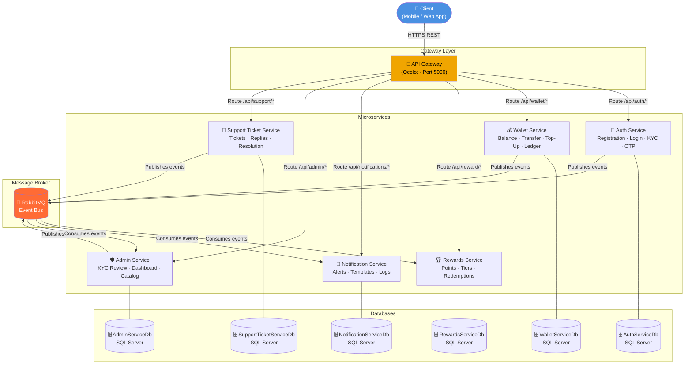
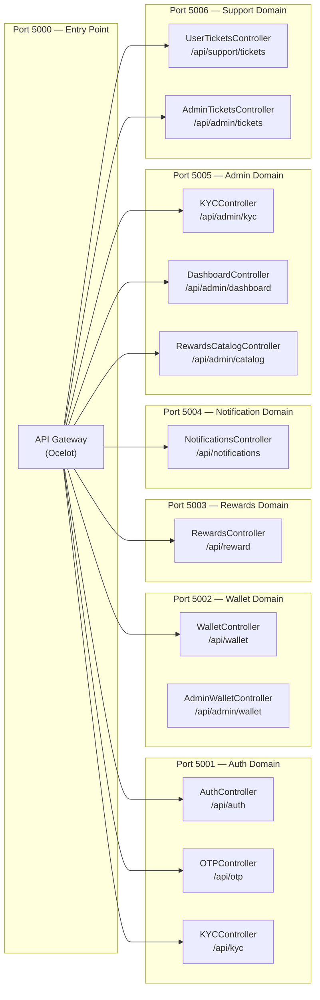
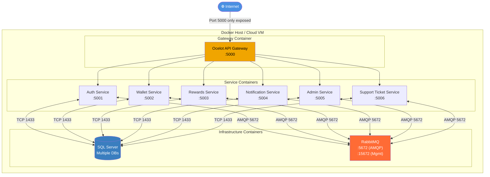
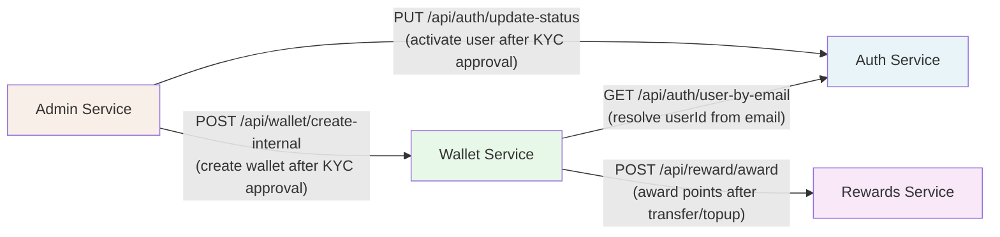
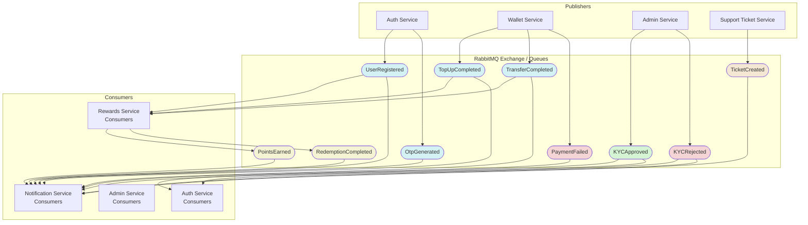
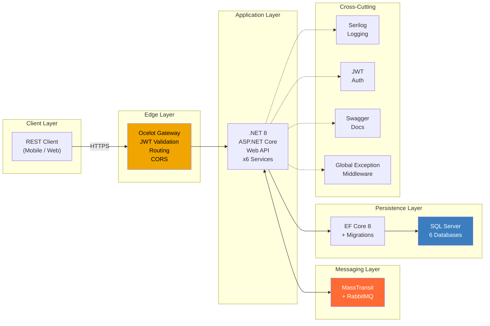

# Architecture Diagrams — Digital Wallet

## Table of Contents
1. [System Overview](#1-system-overview)
2. [Microservices Topology](#2-microservices-topology)
3. [Network & Deployment Architecture](#3-network--deployment-architecture)
4. [Synchronous Communication Map](#4-synchronous-communication-map)
5. [Asynchronous Event Bus Topology](#5-asynchronous-event-bus-topology)
6. [Technology Stack](#6-technology-stack)

---

## 1. System Overview

High-level C4-style container view: how a client interacts with the system and what major building blocks exist.

---

## 2. Microservices Topology

Each service is an independently deployable ASP.NET Core 8 Web API.

---

## 3. Network & Deployment Architecture

---

## 4. Synchronous Communication Map

Services that call each other directly over HTTP (internal network only — never through the gateway).

---

## 5. Asynchronous Event Bus Topology

All events flow through RabbitMQ (MassTransit). Publishers and consumers are decoupled.

---

## 6. Technology Stack

| Layer | Technology | Purpose |
|-------|-----------|---------|
| **Runtime** | .NET 8 / C# | All microservices backend |
| **Web Framework** | ASP.NET Core 8 Web API | REST API hosting |
| **API Gateway** | Ocelot | Request routing, JWT validation |
| **ORM** | Entity Framework Core 8 | SQL Server data access |
| **Database** | SQL Server (multi-instance) | Persistent storage per service |
| **Message Broker** | RabbitMQ | Async event bus |
| **Messaging Library** | MassTransit 8.2 | RabbitMQ abstraction, consumers |
| **Authentication** | JWT Bearer Tokens | Stateless auth with refresh tokens |
| **Password Hashing** | BCrypt | Secure password storage |
| **OTP** | TOTP / numeric OTP | Two-factor auth support |
| **Logging** | Serilog | Structured logging to console + files |
| **API Docs** | Swagger / Swashbuckle 6.8 | OpenAPI spec per service |
| **Containerization** | Docker (multi-stage) | Service packaging & deployment |
| **Migrations** | EF Core Migrations | DB schema version control |
| **Shared Contracts** | SharedContracts project | DTOs, enums, events across services |

