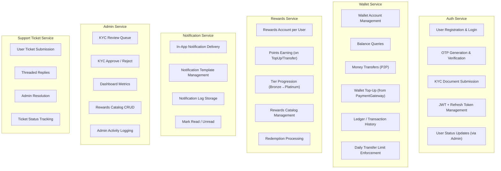
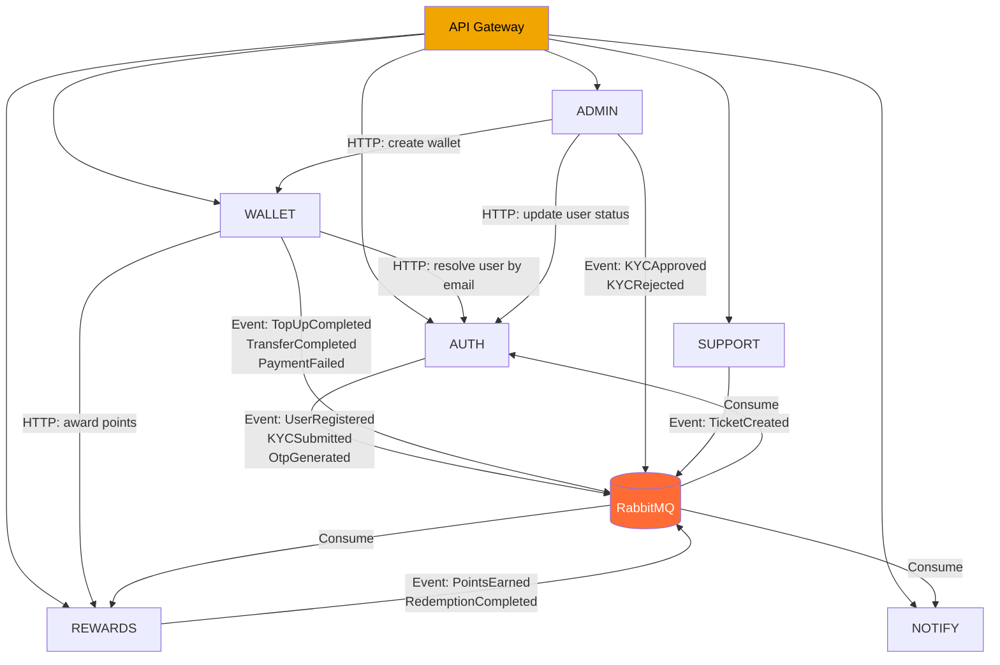
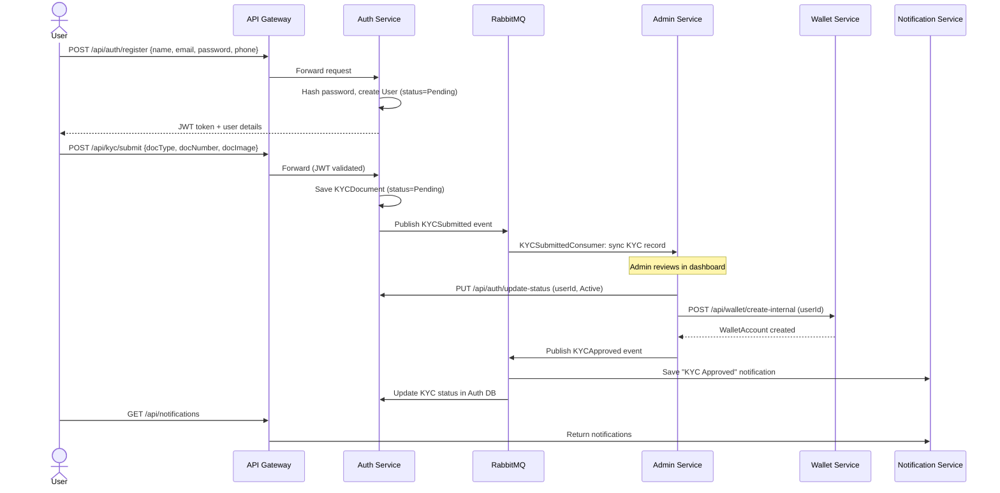
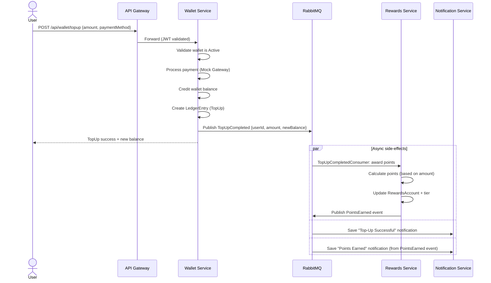
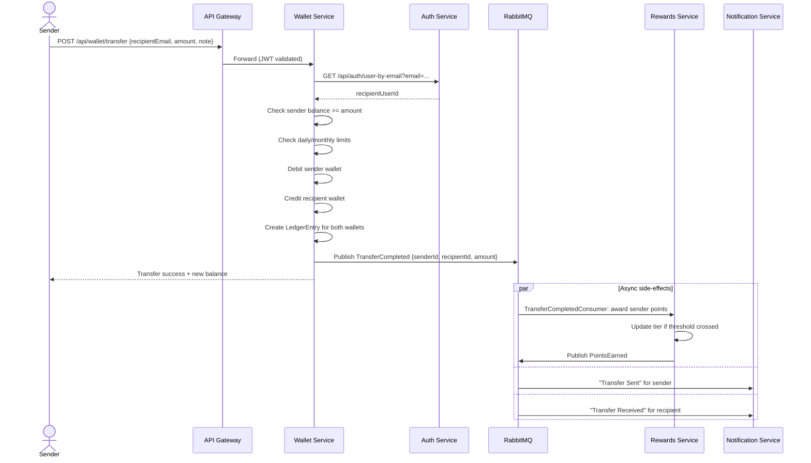
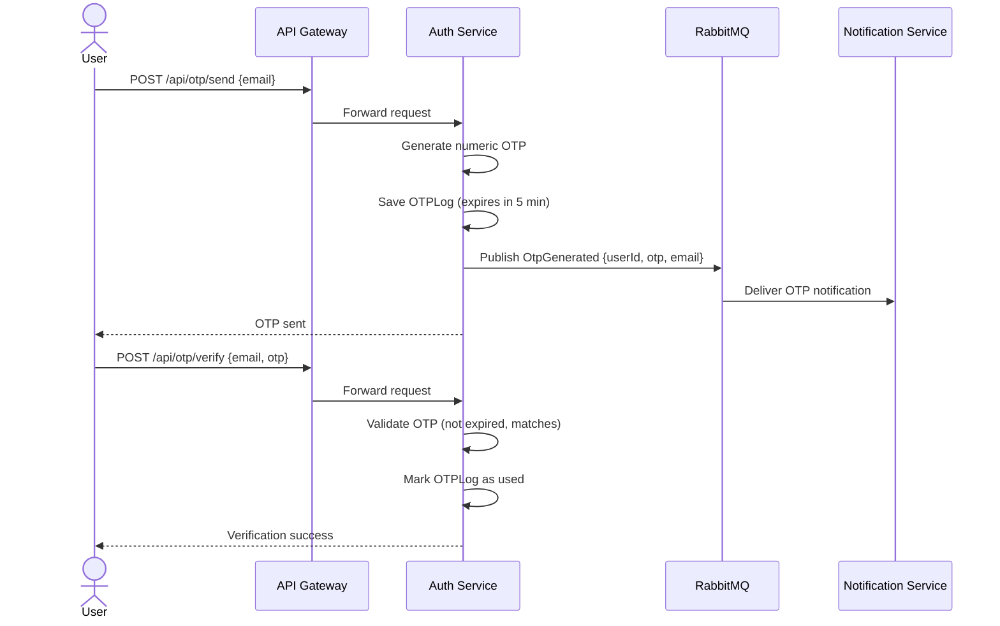
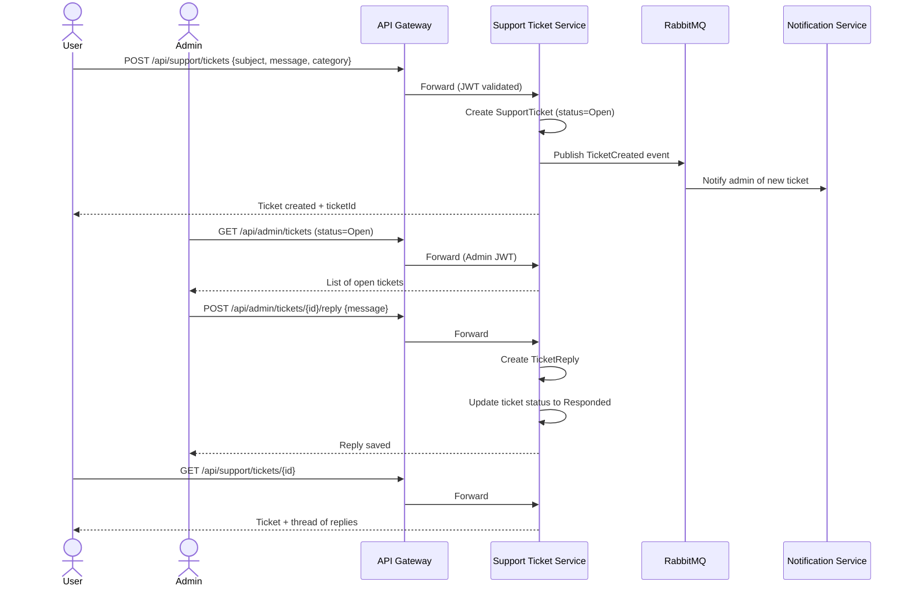
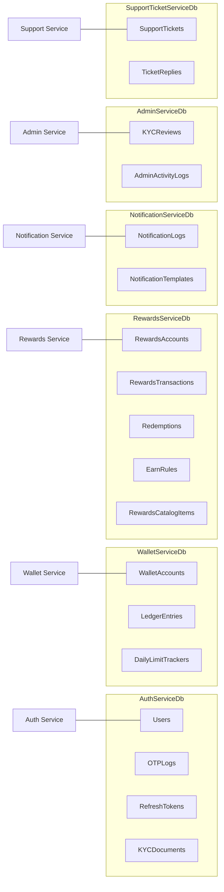
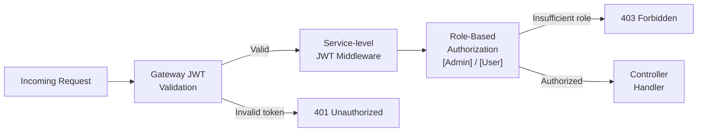

# Backend High-Level Design (HLD) — Digital Wallet

## Table of Contents
1. [Business Context](#1-business-context)
2. [System Goals & Constraints](#2-system-goals--constraints)
3. [Service Responsibilities](#3-service-responsibilities)
4. [Service Dependency Graph](#4-service-dependency-graph)
5. [API Gateway Routing](#5-api-gateway-routing)
6. [Key User Flows](#6-key-user-flows)
7. [Event Bus Topology](#7-event-bus-topology)
8. [Database-Per-Service Strategy](#8-database-per-service-strategy)
9. [Cross-Cutting Concerns](#9-cross-cutting-concerns)
10. [Non-Functional Requirements](#10-non-functional-requirements)

---

## 1. Business Context

The Digital Wallet is a multi-service fintech backend that enables users to:
- Register and verify their identity via KYC (Know Your Customer)
- Maintain a digital wallet with a real-time balance
- Transfer money to other users
- Top-up their wallet via a payment gateway
- Earn loyalty reward points on transactions
- Receive real-time in-app notifications
- Raise and track support tickets
- Administrators can manage KYC approvals, view dashboards, and manage reward catalogs

### Actors

| Actor | Role |
|-------|------|
| **End User** | Registers, submits KYC, transfers money, earns rewards, raises tickets |
| **Admin** | Reviews KYC submissions, manages reward catalog, handles support tickets, views dashboards |
| **System** | Internal services communicating via HTTP and RabbitMQ events |

---

## 2. System Goals & Constraints

### Goals
- Provide a secure, scalable microservices backend for digital wallet operations
- Enforce KYC before wallet activation to comply with financial regulations
- Decouple services using an event-driven architecture (RabbitMQ)
- Enable independent deployment and scaling of each service
- Provide a unified API entry point via API Gateway

### Constraints
- Each service owns its own database (no shared DB)
- Cross-service data access only via API calls or events
- All external-facing APIs require JWT authentication (except register/login/OTP)
- Wallet transfers are synchronous; reward/notification side-effects are async
- Admin operations require `Admin` role in the JWT claims

---

## 3. Service Responsibilities



---

## 4. Service Dependency Graph



---

## 5. API Gateway Routing

The Ocelot gateway is the single entry point on port **5000**. All downstream services are only reachable internally.

| Gateway Route Pattern | Downstream Service | Notes |
|----------------------|--------------------|-------|
| `/api/auth/**` | Auth Service | Register, Login, OTP, KYC |
| `/api/otp/**` | Auth Service | OTP endpoints |
| `/api/kyc/**` | Auth Service | KYC submission |
| `/api/wallet/**` | Wallet Service | Balance, Transfer, Top-Up |
| `/api/reward/**` | Rewards Service | Points, Tiers, Redemptions |
| `/api/notifications/**` | Notification Service | Notifications |
| `/api/admin/**` | Admin Service | KYC Review, Dashboard |
| `/api/support/**` | Support Ticket Service | User & Admin tickets |

**Gateway responsibilities:**
- JWT token validation before forwarding
- HTTPS termination
- CORS policy enforcement
- Request/response logging (Serilog)

---

## 6. Key User Flows

### 6.1 User Registration & KYC Approval



---

### 6.2 Wallet Top-Up Flow



---

### 6.3 Peer-to-Peer Transfer



---

### 6.4 OTP Verification



---

### 6.5 Support Ticket Flow



---

## 7. Event Bus Topology

All async communication uses RabbitMQ with MassTransit. Each event has one publisher and one or more consumers.

| Event | Publisher | Consumer(s) | Trigger |
|-------|-----------|-------------|---------|
| `UserRegistered` | Auth Service | Rewards Service, Notification Service | New user signup |
| `OtpGenerated` | Auth Service | Notification Service | OTP request |
| `TopUpCompleted` | Wallet Service | Rewards Service, Notification Service | Successful top-up |
| `TransferCompleted` | Wallet Service | Rewards Service, Notification Service | Successful P2P transfer |
| `PaymentFailed` | Wallet Service | Notification Service | Failed payment attempt |
| `KYCApproved` | Admin Service | Auth Service, Notification Service | Admin approves KYC |
| `KYCRejected` | Admin Service | Auth Service, Notification Service | Admin rejects KYC |
| `PointsEarned` | Rewards Service | Notification Service | Points awarded to user |
| `RedemptionCompleted` | Rewards Service | Notification Service | User redeems reward |
| `TicketCreated` | Support Service | Notification Service | New support ticket |

---

## 8. Database-Per-Service Strategy

Each service has its own dedicated SQL Server database. Services never query another service's DB directly — they communicate via APIs or events.



**Schema evolution:** Each service uses EF Core migrations, auto-applied on startup in development. Production deployments should run migrations explicitly before rolling service containers.

---

## 9. Cross-Cutting Concerns

### Authentication & Authorization



- JWT tokens are issued by Auth Service (8-hour validity)
- Refresh tokens allow session extension without re-login
- `UserId` is extracted from JWT claims in all services
- Admin-only endpoints use `[Authorize(Roles = "Admin")]`

### Global Exception Handling

- Each service has a `GlobalExceptionMiddleware` (strategy pattern)
- All unhandled exceptions return a standardized `ApiResponse<T>` JSON:
  ```json
  { "success": false, "message": "Error description", "data": null }
  ```

### Logging

- Serilog is configured in every service
- Logs written to console (dev) and rolling files (`Logs/` directory)
- Structured logging with enriched context (service name, request ID)

### API Response Standard

All endpoints return:
```json
{
  "success": true | false,
  "message": "Human-readable message",
  "data": { ... } | null
}
```

Paginated responses extend with:
```json
{
  "success": true,
  "message": "...",
  "data": {
    "items": [...],
    "page": 1,
    "pageSize": 20,
    "totalCount": 150,
    "totalPages": 8
  }
}
```

---

## 10. Non-Functional Requirements

| Requirement | Approach |
|-------------|---------|
| **Security** | JWT auth, BCrypt hashing, OTP for sensitive ops, HTTPS only |
| **Scalability** | Stateless services (JWT), can scale horizontally behind a load balancer |
| **Isolation** | Database-per-service prevents cascading schema failures |
| **Resilience** | RabbitMQ retries via MassTransit; services degrade gracefully if upstream is down |
| **Observability** | Serilog structured logging; Swagger per service; RabbitMQ management UI |
| **Maintainability** | Clean Architecture in each service; shared DTOs in SharedContracts project |
| **Deployability** | Dockerized multi-stage builds; environment-variable-driven config |
| **Data Consistency** | Eventual consistency via events (not distributed transactions) |
| **Auditability** | AdminActivityLog tracks all admin actions; LedgerEntry is append-only |
