# Backend Low-Level Design (LLD) — Digital Wallet

## Table of Contents
1. [Clean Architecture Overview](#1-clean-architecture-overview)
2. [Auth Service LLD](#2-auth-service-lld)
3. [Wallet Service LLD](#3-wallet-service-lld)
4. [Rewards Service LLD](#4-rewards-service-lld)
5. [Notification Service LLD](#5-notification-service-lld)
6. [Admin Service LLD](#6-admin-service-lld)
7. [Support Ticket Service LLD](#7-support-ticket-service-lld)
8. [Shared Contracts](#8-shared-contracts)
9. [Middleware Pipeline](#9-middleware-pipeline)
10. [JWT Token Lifecycle](#10-jwt-token-lifecycle)
11. [API Endpoint Catalog](#11-api-endpoint-catalog)

---

## 1. Clean Architecture Overview

Every service follows the same four-layer Clean Architecture:

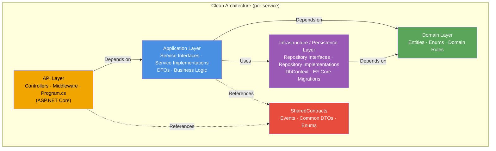
```mermaid
graph TD
    subgraph "Clean Architecture (per service)"
        API["API Layer\nControllers · Middleware · Program.cs\n(ASP.NET Core)"]
        APP["Application Layer\nService Interfaces · Service Implementations\nDTOs · Business Logic"]
        DOMAIN["Domain Layer\nEntities · Enums · Domain Rules"]
        INFRA["Infrastructure / Persistence Layer\nRepository Interfaces · Repository Implementations\nDbContext · EF Core Migrations"]
        SHARED["SharedContracts\nEvents · Common DTOs · Enums"]
    end

    API -->|"Depends on"| APP
    APP -->|"Depends on"| DOMAIN
    APP -->|"Uses"| INFRA
    INFRA -->|"Depends on"| DOMAIN
    API -.->|"References"| SHARED
    APP -.->|"References"| SHARED

    style API fill:#f0a500,color:#000
    style APP fill:#4a90e2,color:#fff
    style DOMAIN fill:#5ba55b,color:#fff
    style INFRA fill:#9b59b6,color:#fff
    style SHARED fill:#e74c3c,color:#fff
```

**Dependency Rule:** Dependencies only point inward. Domain knows nothing about infrastructure or API.

---

## 2. Auth Service LLD

### 2.1 Domain Entities

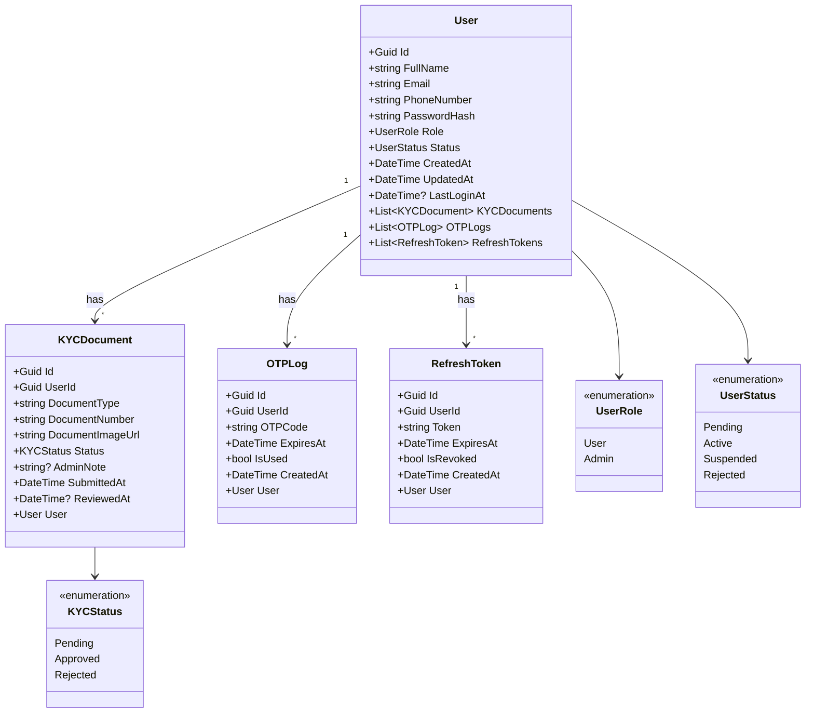
```mermaid
classDiagram
    class User {
        +Guid Id
        +string FullName
        +string Email
        +string PhoneNumber
        +string PasswordHash
        +UserRole Role
        +UserStatus Status
        +DateTime CreatedAt
        +DateTime UpdatedAt
        +DateTime? LastLoginAt
        +List~KYCDocument~ KYCDocuments
        +List~OTPLog~ OTPLogs
        +List~RefreshToken~ RefreshTokens
    }

    class KYCDocument {
        +Guid Id
        +Guid UserId
        +string DocumentType
        +string DocumentNumber
        +string DocumentImageUrl
        +KYCStatus Status
        +string? AdminNote
        +DateTime SubmittedAt
        +DateTime? ReviewedAt
        +User User
    }

    class OTPLog {
        +Guid Id
        +Guid UserId
        +string OTPCode
        +DateTime ExpiresAt
        +bool IsUsed
        +DateTime CreatedAt
        +User User
    }

    class RefreshToken {
        +Guid Id
        +Guid UserId
        +string Token
        +DateTime ExpiresAt
        +bool IsRevoked
        +DateTime CreatedAt
        +User User
    }

    class UserRole {
        <<enumeration>>
        User
        Admin
    }

    class UserStatus {
        <<enumeration>>
        Pending
        Active
        Suspended
        Rejected
    }

    class KYCStatus {
        <<enumeration>>
        Pending
        Approved
        Rejected
    }

    User "1" --> "*" KYCDocument : has
    User "1" --> "*" OTPLog : has
    User "1" --> "*" RefreshToken : has
    User --> UserRole
    User --> UserStatus
    KYCDocument --> KYCStatus
```

### 2.2 Service Interfaces


```mermaid
classDiagram
    class IAuthService {
        <<interface>>
        +RegisterAsync(RegisterDto dto) Task~AuthResponseDto~
        +LoginAsync(LoginDto dto) Task~AuthResponseDto~
        +RefreshTokenAsync(string token) Task~AuthResponseDto~
        +GetProfileAsync(Guid userId) Task~UserProfileDto~
        +UpdateUserStatusAsync(Guid userId, UserStatus status) Task
        +GetUserByEmailAsync(string email) Task~UserIdDto~
    }

    class IKYCService {
        <<interface>>
        +SubmitKYCAsync(Guid userId, KYCSubmitDto dto) Task~KYCResponseDto~
        +GetKYCStatusAsync(Guid userId) Task~KYCStatusDto~
    }

    class IOTPService {
        <<interface>>
        +SendOTPAsync(string email) Task
        +VerifyOTPAsync(string email, string otp) Task~bool~
    }

    class ITokenService {
        <<interface>>
        +GenerateAccessToken(User user) string
        +GenerateRefreshToken() string
        +GetPrincipalFromToken(string token) ClaimsPrincipal
    }

    class IAuthRepository {
        <<interface>>
        +GetByEmailAsync(string email) Task~User~
        +GetByIdAsync(Guid id) Task~User~
        +CreateAsync(User user) Task~User~
        +UpdateAsync(User user) Task
        +GetAllAsync() Task~List~User~~
    }
```

### 2.3 Database Schema (ER Diagram)

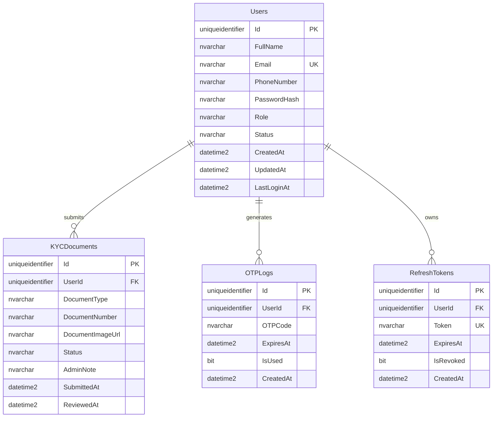
```mermaid
erDiagram
    Users {
        uniqueidentifier Id PK
        nvarchar FullName
        nvarchar Email UK
        nvarchar PhoneNumber
        nvarchar PasswordHash
        nvarchar Role
        nvarchar Status
        datetime2 CreatedAt
        datetime2 UpdatedAt
        datetime2 LastLoginAt
    }

    KYCDocuments {
        uniqueidentifier Id PK
        uniqueidentifier UserId FK
        nvarchar DocumentType
        nvarchar DocumentNumber
        nvarchar DocumentImageUrl
        nvarchar Status
        nvarchar AdminNote
        datetime2 SubmittedAt
        datetime2 ReviewedAt
    }

    OTPLogs {
        uniqueidentifier Id PK
        uniqueidentifier UserId FK
        nvarchar OTPCode
        datetime2 ExpiresAt
        bit IsUsed
        datetime2 CreatedAt
    }

    RefreshTokens {
        uniqueidentifier Id PK
        uniqueidentifier UserId FK
        nvarchar Token UK
        datetime2 ExpiresAt
        bit IsRevoked
        datetime2 CreatedAt
    }

    Users ||--o{ KYCDocuments : "submits"
    Users ||--o{ OTPLogs : "generates"
    Users ||--o{ RefreshTokens : "owns"
```

---

## 3. Wallet Service LLD

### 3.1 Domain Entities

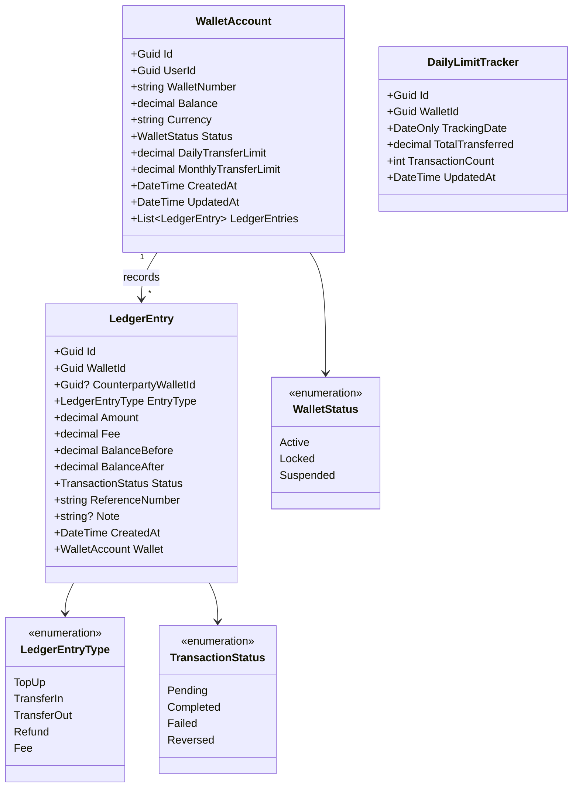
```mermaid
classDiagram
    class WalletAccount {
        +Guid Id
        +Guid UserId
        +string WalletNumber
        +decimal Balance
        +string Currency
        +WalletStatus Status
        +decimal DailyTransferLimit
        +decimal MonthlyTransferLimit
        +DateTime CreatedAt
        +DateTime UpdatedAt
        +List~LedgerEntry~ LedgerEntries
    }

    class LedgerEntry {
        +Guid Id
        +Guid WalletId
        +Guid? CounterpartyWalletId
        +LedgerEntryType EntryType
        +decimal Amount
        +decimal Fee
        +decimal BalanceBefore
        +decimal BalanceAfter
        +TransactionStatus Status
        +string ReferenceNumber
        +string? Note
        +DateTime CreatedAt
        +WalletAccount Wallet
    }

    class DailyLimitTracker {
        +Guid Id
        +Guid WalletId
        +DateOnly TrackingDate
        +decimal TotalTransferred
        +int TransactionCount
        +DateTime UpdatedAt
    }

    class WalletStatus {
        <<enumeration>>
        Active
        Locked
        Suspended
    }

    class LedgerEntryType {
        <<enumeration>>
        TopUp
        TransferIn
        TransferOut
        Refund
        Fee
    }

    class TransactionStatus {
        <<enumeration>>
        Pending
        Completed
        Failed
        Reversed
    }

    WalletAccount "1" --> "*" LedgerEntry : records
    WalletAccount --> WalletStatus
    LedgerEntry --> LedgerEntryType
    LedgerEntry --> TransactionStatus
```

### 3.2 CQRS Pattern (Wallet Service)

Wallet Service implements a lightweight CQRS — read and write concerns separated into distinct service interfaces.

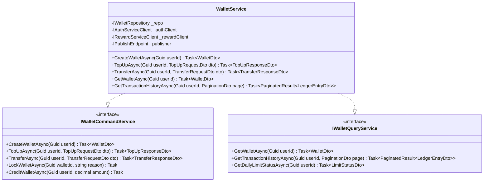
```mermaid
classDiagram
    class IWalletCommandService {
        <<interface>>
        +CreateWalletAsync(Guid userId) Task~WalletDto~
        +TopUpAsync(Guid userId, TopUpRequestDto dto) Task~TopUpResponseDto~
        +TransferAsync(Guid userId, TransferRequestDto dto) Task~TransferResponseDto~
        +LockWalletAsync(Guid walletId, string reason) Task
        +CreditWalletAsync(Guid userId, decimal amount) Task
    }

    class IWalletQueryService {
        <<interface>>
        +GetWalletAsync(Guid userId) Task~WalletDto~
        +GetTransactionHistoryAsync(Guid userId, PaginationDto page) Task~PaginatedResult~LedgerEntryDto~~
        +GetDailyLimitStatusAsync(Guid userId) Task~LimitStatusDto~
    }

    class WalletService {
        -IWalletRepository _repo
        -IAuthServiceClient _authClient
        -IRewardServiceClient _rewardClient
        -IPublishEndpoint _publisher
        +CreateWalletAsync(Guid userId) Task~WalletDto~
        +TopUpAsync(Guid userId, TopUpRequestDto dto) Task~TopUpResponseDto~
        +TransferAsync(Guid userId, TransferRequestDto dto) Task~TransferResponseDto~
        +GetWalletAsync(Guid userId) Task~WalletDto~
        +GetTransactionHistoryAsync(Guid userId, PaginationDto page) Task~PaginatedResult~LedgerEntryDto~~
    }

    WalletService ..|> IWalletCommandService
    WalletService ..|> IWalletQueryService
```

### 3.3 Database Schema

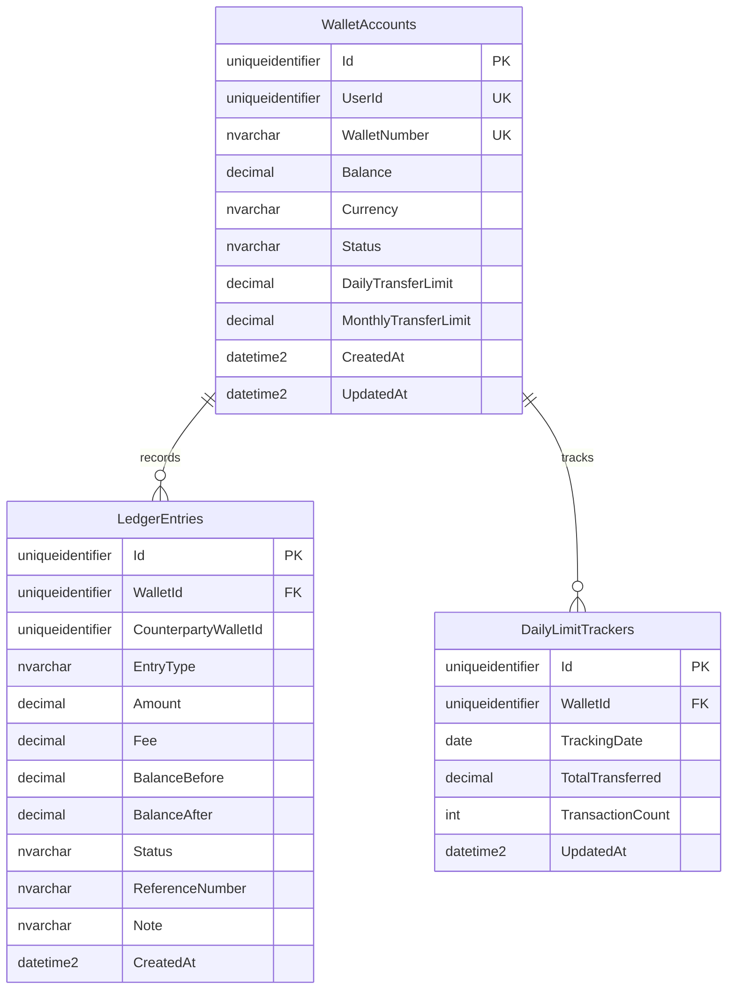
```mermaid
erDiagram
    WalletAccounts {
        uniqueidentifier Id PK
        uniqueidentifier UserId UK
        nvarchar WalletNumber UK
        decimal Balance
        nvarchar Currency
        nvarchar Status
        decimal DailyTransferLimit
        decimal MonthlyTransferLimit
        datetime2 CreatedAt
        datetime2 UpdatedAt
    }

    LedgerEntries {
        uniqueidentifier Id PK
        uniqueidentifier WalletId FK
        uniqueidentifier CounterpartyWalletId
        nvarchar EntryType
        decimal Amount
        decimal Fee
        decimal BalanceBefore
        decimal BalanceAfter
        nvarchar Status
        nvarchar ReferenceNumber
        nvarchar Note
        datetime2 CreatedAt
    }

    DailyLimitTrackers {
        uniqueidentifier Id PK
        uniqueidentifier WalletId FK
        date TrackingDate
        decimal TotalTransferred
        int TransactionCount
        datetime2 UpdatedAt
    }

    WalletAccounts ||--o{ LedgerEntries : "records"
    WalletAccounts ||--o{ DailyLimitTrackers : "tracks"
```

---

## 4. Rewards Service LLD

### 4.1 Domain Entities

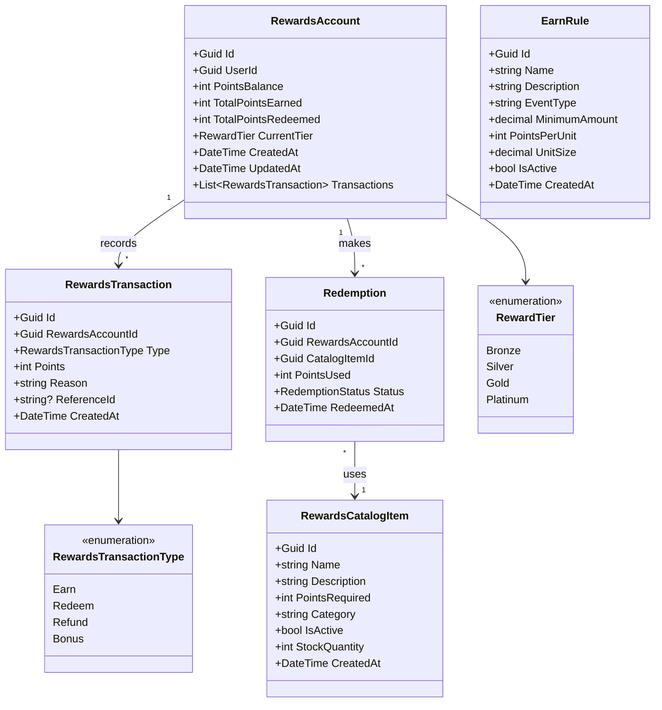
```mermaid
classDiagram
    class RewardsAccount {
        +Guid Id
        +Guid UserId
        +int PointsBalance
        +int TotalPointsEarned
        +int TotalPointsRedeemed
        +RewardTier CurrentTier
        +DateTime CreatedAt
        +DateTime UpdatedAt
        +List~RewardsTransaction~ Transactions
    }

    class RewardsTransaction {
        +Guid Id
        +Guid RewardsAccountId
        +RewardsTransactionType Type
        +int Points
        +string Reason
        +string? ReferenceId
        +DateTime CreatedAt
    }

    class EarnRule {
        +Guid Id
        +string Name
        +string Description
        +string EventType
        +decimal MinimumAmount
        +int PointsPerUnit
        +decimal UnitSize
        +bool IsActive
        +DateTime CreatedAt
    }

    class RewardsCatalogItem {
        +Guid Id
        +string Name
        +string Description
        +int PointsRequired
        +string Category
        +bool IsActive
        +int StockQuantity
        +DateTime CreatedAt
    }

    class Redemption {
        +Guid Id
        +Guid RewardsAccountId
        +Guid CatalogItemId
        +int PointsUsed
        +RedemptionStatus Status
        +DateTime RedeemedAt
    }

    class RewardTier {
        <<enumeration>>
        Bronze
        Silver
        Gold
        Platinum
    }

    class RewardsTransactionType {
        <<enumeration>>
        Earn
        Redeem
        Refund
        Bonus
    }

    RewardsAccount "1" --> "*" RewardsTransaction : records
    RewardsAccount "1" --> "*" Redemption : makes
    Redemption "*" --> "1" RewardsCatalogItem : uses
    RewardsAccount --> RewardTier
    RewardsTransaction --> RewardsTransactionType
```

### 4.2 Tier Thresholds

| Tier | Minimum Cumulative Points |
|------|--------------------------|
| Bronze | 0 |
| Silver | 1,000 |
| Gold | 5,000 |
| Platinum | 15,000 |

### 4.3 Database Schema

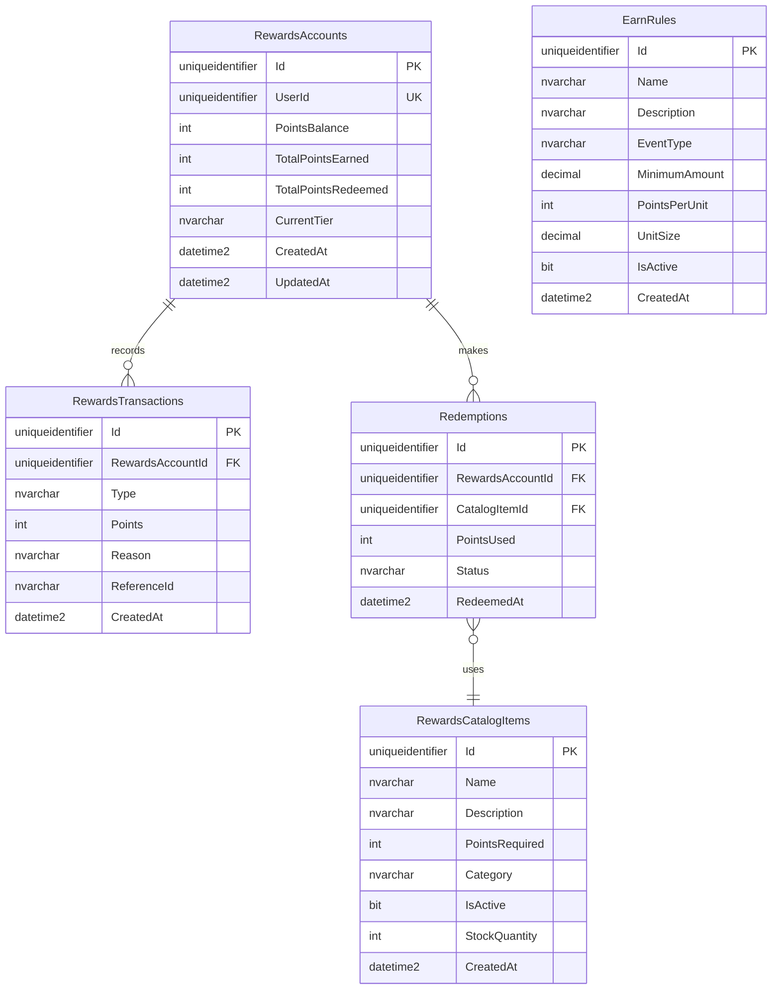
```mermaid
erDiagram
    RewardsAccounts {
        uniqueidentifier Id PK
        uniqueidentifier UserId UK
        int PointsBalance
        int TotalPointsEarned
        int TotalPointsRedeemed
        nvarchar CurrentTier
        datetime2 CreatedAt
        datetime2 UpdatedAt
    }

    RewardsTransactions {
        uniqueidentifier Id PK
        uniqueidentifier RewardsAccountId FK
        nvarchar Type
        int Points
        nvarchar Reason
        nvarchar ReferenceId
        datetime2 CreatedAt
    }

    EarnRules {
        uniqueidentifier Id PK
        nvarchar Name
        nvarchar Description
        nvarchar EventType
        decimal MinimumAmount
        int PointsPerUnit
        decimal UnitSize
        bit IsActive
        datetime2 CreatedAt
    }

    RewardsCatalogItems {
        uniqueidentifier Id PK
        nvarchar Name
        nvarchar Description
        int PointsRequired
        nvarchar Category
        bit IsActive
        int StockQuantity
        datetime2 CreatedAt
    }

    Redemptions {
        uniqueidentifier Id PK
        uniqueidentifier RewardsAccountId FK
        uniqueidentifier CatalogItemId FK
        int PointsUsed
        nvarchar Status
        datetime2 RedeemedAt
    }

    RewardsAccounts ||--o{ RewardsTransactions : "records"
    RewardsAccounts ||--o{ Redemptions : "makes"
    Redemptions }o--|| RewardsCatalogItems : "uses"
```

---

## 5. Notification Service LLD

### 5.1 Domain Entities

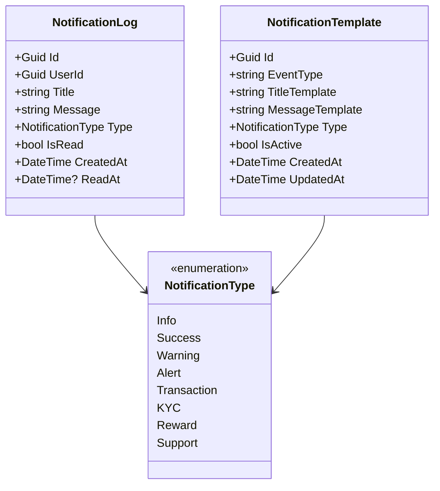
```mermaid
classDiagram
    class NotificationLog {
        +Guid Id
        +Guid UserId
        +string Title
        +string Message
        +NotificationType Type
        +bool IsRead
        +DateTime CreatedAt
        +DateTime? ReadAt
    }

    class NotificationTemplate {
        +Guid Id
        +string EventType
        +string TitleTemplate
        +string MessageTemplate
        +NotificationType Type
        +bool IsActive
        +DateTime CreatedAt
        +DateTime UpdatedAt
    }

    class NotificationType {
        <<enumeration>>
        Info
        Success
        Warning
        Alert
        Transaction
        KYC
        Reward
        Support
    }

    NotificationLog --> NotificationType
    NotificationTemplate --> NotificationType
```

### 5.2 Database Schema

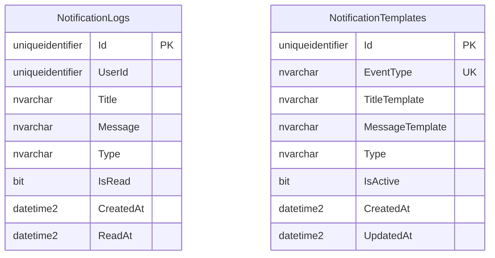
```mermaid
erDiagram
    NotificationLogs {
        uniqueidentifier Id PK
        uniqueidentifier UserId
        nvarchar Title
        nvarchar Message
        nvarchar Type
        bit IsRead
        datetime2 CreatedAt
        datetime2 ReadAt
    }

    NotificationTemplates {
        uniqueidentifier Id PK
        nvarchar EventType UK
        nvarchar TitleTemplate
        nvarchar MessageTemplate
        nvarchar Type
        bit IsActive
        datetime2 CreatedAt
        datetime2 UpdatedAt
    }
```

### 5.3 MassTransit Consumers


```mermaid
classDiagram
    class IConsumer~T~ {
        <<interface>>
        +Consume(ConsumeContext~T~ context) Task
    }

    class UserRegisteredConsumer {
        +Consume(ConsumeContext~UserRegistered~ context) Task
    }
    class TopUpCompletedConsumer {
        +Consume(ConsumeContext~TopUpCompleted~ context) Task
    }
    class TransferCompletedConsumer {
        +Consume(ConsumeContext~TransferCompleted~ context) Task
    }
    class KYCApprovedConsumer {
        +Consume(ConsumeContext~KYCApproved~ context) Task
    }
    class KYCRejectedConsumer {
        +Consume(ConsumeContext~KYCRejected~ context) Task
    }
    class PointsEarnedConsumer {
        +Consume(ConsumeContext~PointsEarned~ context) Task
    }
    class RedemptionCompletedConsumer {
        +Consume(ConsumeContext~RedemptionCompleted~ context) Task
    }
    class TicketCreatedConsumer {
        +Consume(ConsumeContext~TicketCreated~ context) Task
    }
    class OtpGeneratedConsumer {
        +Consume(ConsumeContext~OtpGenerated~ context) Task
    }
    class PaymentFailedConsumer {
        +Consume(ConsumeContext~PaymentFailed~ context) Task
    }

    UserRegisteredConsumer ..|> IConsumer
    TopUpCompletedConsumer ..|> IConsumer
    TransferCompletedConsumer ..|> IConsumer
    KYCApprovedConsumer ..|> IConsumer
    KYCRejectedConsumer ..|> IConsumer
    PointsEarnedConsumer ..|> IConsumer
    RedemptionCompletedConsumer ..|> IConsumer
    TicketCreatedConsumer ..|> IConsumer
    OtpGeneratedConsumer ..|> IConsumer
    PaymentFailedConsumer ..|> IConsumer
```

---

## 6. Admin Service LLD

### 6.1 Domain Entities

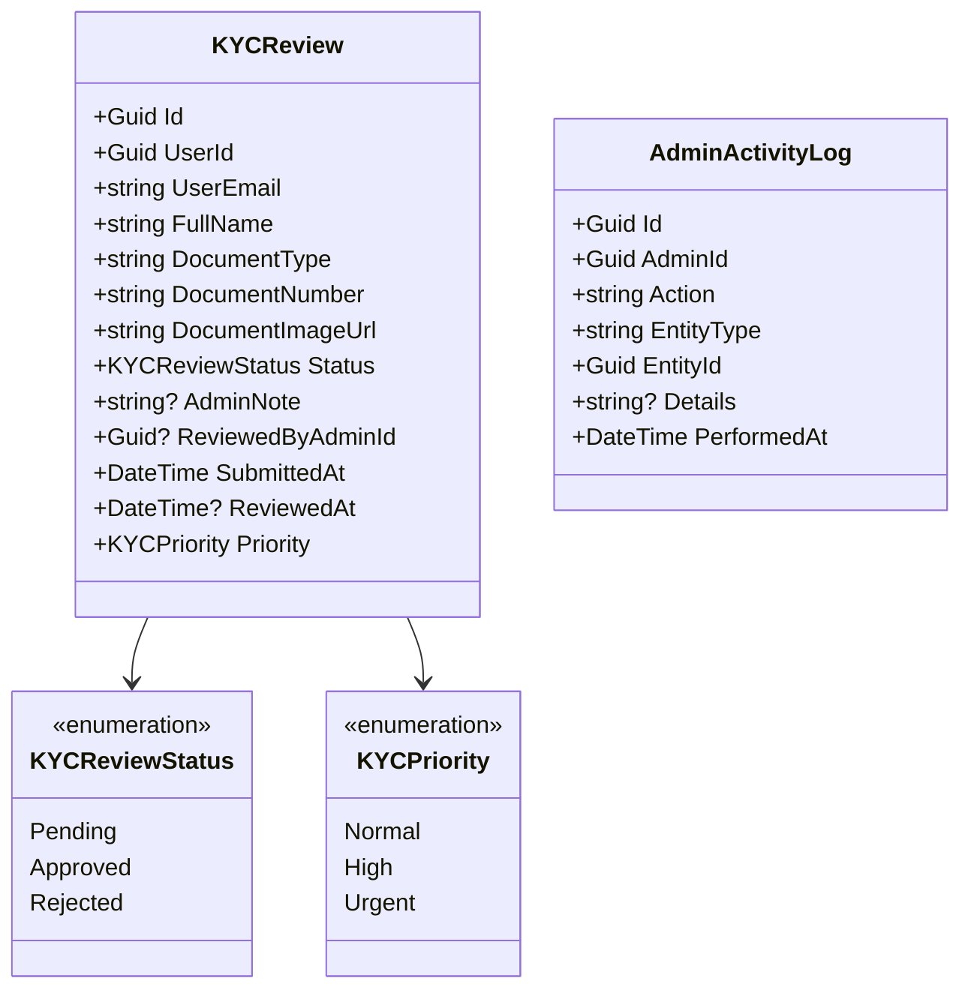
```mermaid
classDiagram
    class KYCReview {
        +Guid Id
        +Guid UserId
        +string UserEmail
        +string FullName
        +string DocumentType
        +string DocumentNumber
        +string DocumentImageUrl
        +KYCReviewStatus Status
        +string? AdminNote
        +Guid? ReviewedByAdminId
        +DateTime SubmittedAt
        +DateTime? ReviewedAt
        +KYCPriority Priority
    }

    class AdminActivityLog {
        +Guid Id
        +Guid AdminId
        +string Action
        +string EntityType
        +Guid EntityId
        +string? Details
        +DateTime PerformedAt
    }

    class KYCReviewStatus {
        <<enumeration>>
        Pending
        Approved
        Rejected
    }

    class KYCPriority {
        <<enumeration>>
        Normal
        High
        Urgent
    }

    KYCReview --> KYCReviewStatus
    KYCReview --> KYCPriority
```

### 6.2 Database Schema

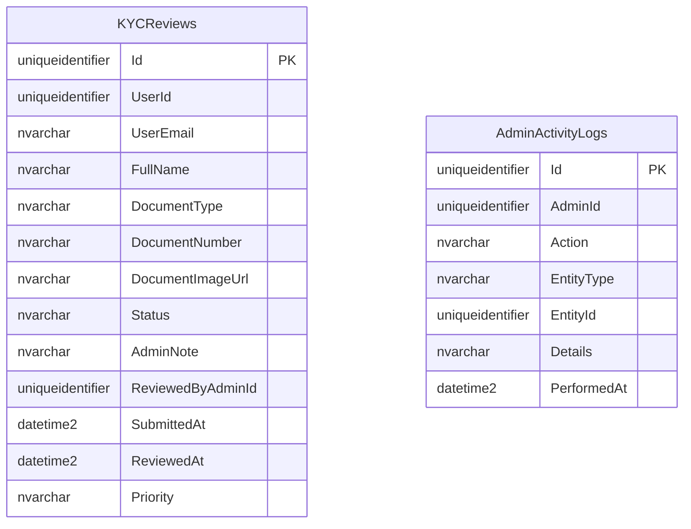
```mermaid
erDiagram
    KYCReviews {
        uniqueidentifier Id PK
        uniqueidentifier UserId
        nvarchar UserEmail
        nvarchar FullName
        nvarchar DocumentType
        nvarchar DocumentNumber
        nvarchar DocumentImageUrl
        nvarchar Status
        nvarchar AdminNote
        uniqueidentifier ReviewedByAdminId
        datetime2 SubmittedAt
        datetime2 ReviewedAt
        nvarchar Priority
    }

    AdminActivityLogs {
        uniqueidentifier Id PK
        uniqueidentifier AdminId
        nvarchar Action
        nvarchar EntityType
        uniqueidentifier EntityId
        nvarchar Details
        datetime2 PerformedAt
    }
```

---

## 7. Support Ticket Service LLD

### 7.1 Domain Entities

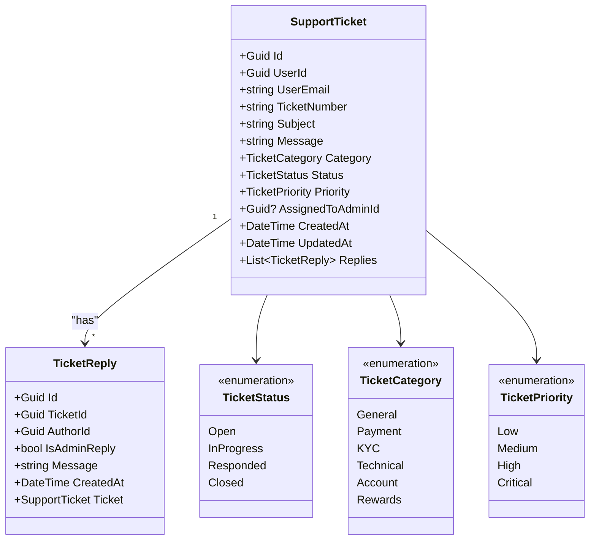
```mermaid
classDiagram
    class SupportTicket {
        +Guid Id
        +Guid UserId
        +string UserEmail
        +string TicketNumber
        +string Subject
        +string Message
        +TicketCategory Category
        +TicketStatus Status
        +TicketPriority Priority
        +Guid? AssignedToAdminId
        +DateTime CreatedAt
        +DateTime UpdatedAt
        +List~TicketReply~ Replies
    }

    class TicketReply {
        +Guid Id
        +Guid TicketId
        +Guid AuthorId
        +bool IsAdminReply
        +string Message
        +DateTime CreatedAt
        +SupportTicket Ticket
    }

    class TicketStatus {
        <<enumeration>>
        Open
        InProgress
        Responded
        Closed
    }

    class TicketCategory {
        <<enumeration>>
        General
        Payment
        KYC
        Technical
        Account
        Rewards
    }

    class TicketPriority {
        <<enumeration>>
        Low
        Medium
        High
        Critical
    }

    SupportTicket "1" --> "*" TicketReply : "has"
    SupportTicket --> TicketStatus
    SupportTicket --> TicketCategory
    SupportTicket --> TicketPriority
```

### 7.2 Database Schema

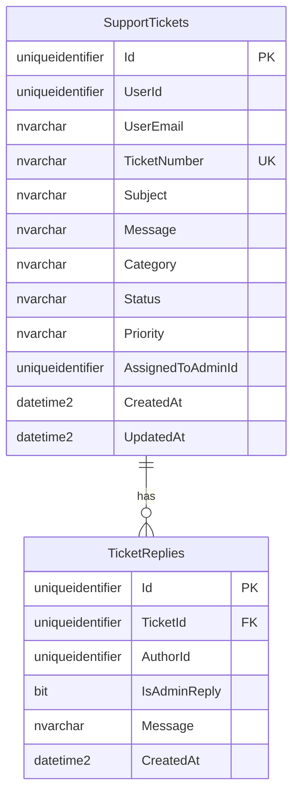
```mermaid
erDiagram
    SupportTickets {
        uniqueidentifier Id PK
        uniqueidentifier UserId
        nvarchar UserEmail
        nvarchar TicketNumber UK
        nvarchar Subject
        nvarchar Message
        nvarchar Category
        nvarchar Status
        nvarchar Priority
        uniqueidentifier AssignedToAdminId
        datetime2 CreatedAt
        datetime2 UpdatedAt
    }

    TicketReplies {
        uniqueidentifier Id PK
        uniqueidentifier TicketId FK
        uniqueidentifier AuthorId
        bit IsAdminReply
        nvarchar Message
        datetime2 CreatedAt
    }

    SupportTickets ||--o{ TicketReplies : "has"
```

---

## 8. Shared Contracts

All services reference the `SharedContracts` project for common types, preventing duplication.

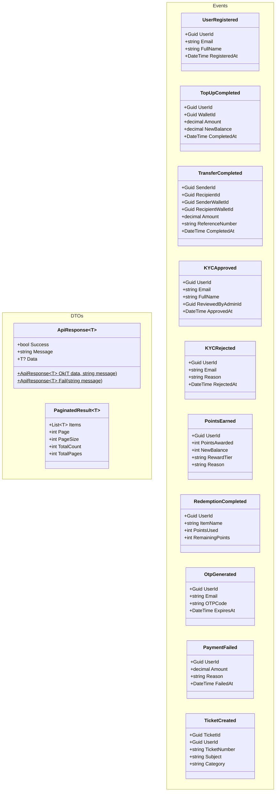
```mermaid
classDiagram
    namespace DTOs {
        class ApiResponse~T~ {
            +bool Success
            +string Message
            +T? Data
            +ApiResponse~T~ Ok(T data, string message)$
            +ApiResponse~T~ Fail(string message)$
        }

        class PaginatedResult~T~ {
            +List~T~ Items
            +int Page
            +int PageSize
            +int TotalCount
            +int TotalPages
        }
    }

    namespace Events {
        class UserRegistered {
            +Guid UserId
            +string Email
            +string FullName
            +DateTime RegisteredAt
        }

        class TopUpCompleted {
            +Guid UserId
            +Guid WalletId
            +decimal Amount
            +decimal NewBalance
            +DateTime CompletedAt
        }

        class TransferCompleted {
            +Guid SenderId
            +Guid RecipientId
            +Guid SenderWalletId
            +Guid RecipientWalletId
            +decimal Amount
            +string ReferenceNumber
            +DateTime CompletedAt
        }

        class KYCApproved {
            +Guid UserId
            +string Email
            +string FullName
            +Guid ReviewedByAdminId
            +DateTime ApprovedAt
        }

        class KYCRejected {
            +Guid UserId
            +string Email
            +string Reason
            +DateTime RejectedAt
        }

        class PointsEarned {
            +Guid UserId
            +int PointsAwarded
            +int NewBalance
            +string RewardTier
            +string Reason
        }

        class RedemptionCompleted {
            +Guid UserId
            +string ItemName
            +int PointsUsed
            +int RemainingPoints
        }

        class OtpGenerated {
            +Guid UserId
            +string Email
            +string OTPCode
            +DateTime ExpiresAt
        }

        class PaymentFailed {
            +Guid UserId
            +decimal Amount
            +string Reason
            +DateTime FailedAt
        }

        class TicketCreated {
            +Guid TicketId
            +Guid UserId
            +string TicketNumber
            +string Subject
            +string Category
        }
    }
```

---

## 9. Middleware Pipeline

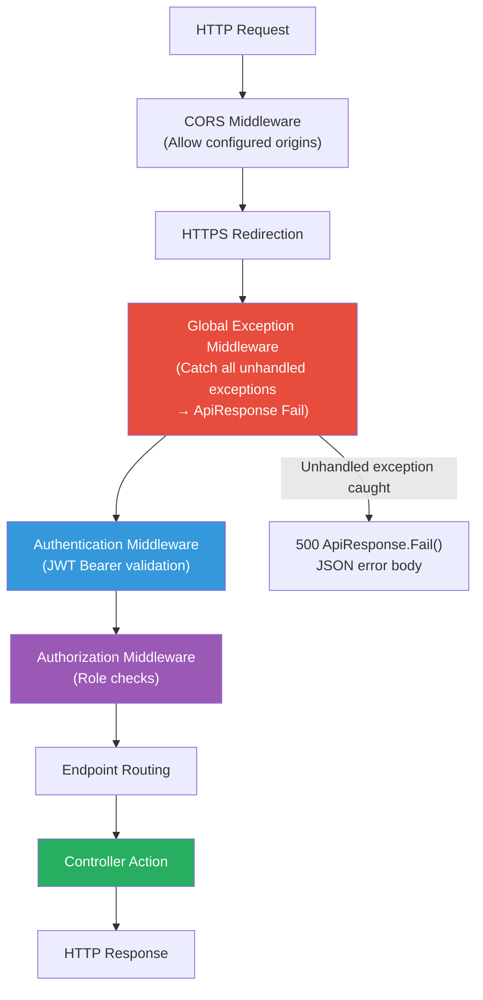
```mermaid
flowchart TD
    REQ["HTTP Request"]

    CORS["CORS Middleware\n(Allow configured origins)"]
    HTTPS["HTTPS Redirection"]
    AUTH_MW["Authentication Middleware\n(JWT Bearer validation)"]
    AUTHZ_MW["Authorization Middleware\n(Role checks)"]
    EX_MW["Global Exception Middleware\n(Catch all unhandled exceptions\n→ ApiResponse Fail)"]
    ROUTE["Endpoint Routing"]
    CTRL["Controller Action"]
    RESP["HTTP Response"]

    REQ --> CORS
    CORS --> HTTPS
    HTTPS --> EX_MW
    EX_MW --> AUTH_MW
    AUTH_MW --> AUTHZ_MW
    AUTHZ_MW --> ROUTE
    ROUTE --> CTRL
    CTRL --> RESP

    EX_MW -->|"Unhandled exception caught"| ERR_RESP["500 ApiResponse.Fail()\nJSON error body"]

    style EX_MW fill:#e74c3c,color:#fff
    style AUTH_MW fill:#3498db,color:#fff
    style AUTHZ_MW fill:#9b59b6,color:#fff
    style CTRL fill:#27ae60,color:#fff
```

**Exception Middleware Strategy Pattern:**

Each service registers typed exception handlers for common error scenarios:
- `ValidationException` → 400 Bad Request
- `NotFoundException` → 404 Not Found
- `UnauthorizedException` → 401 Unauthorized
- `ForbiddenException` → 403 Forbidden
- `ConflictException` → 409 Conflict
- `Exception` (catch-all) → 500 Internal Server Error

---

## 10. JWT Token Lifecycle

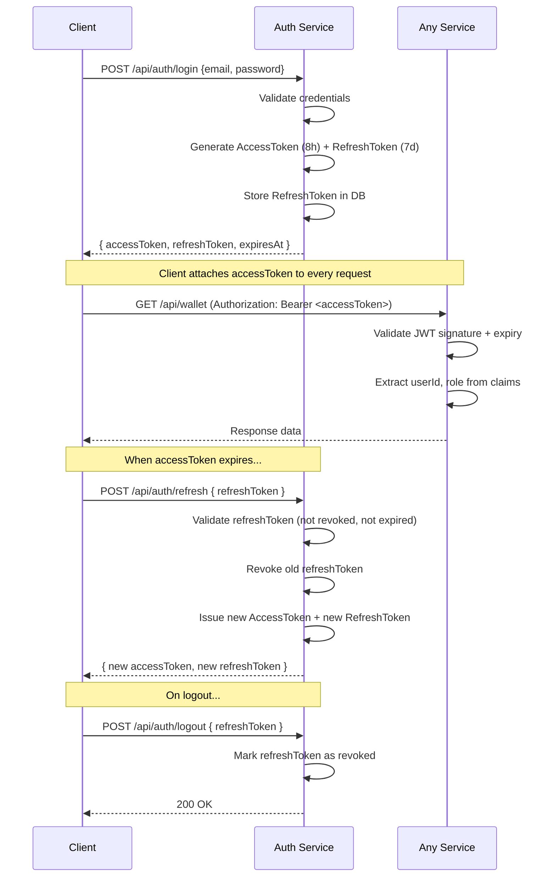
```mermaid
sequenceDiagram
    participant C as Client
    participant A as Auth Service
    participant S as Any Service

    C->>A: POST /api/auth/login {email, password}
    A->>A: Validate credentials
    A->>A: Generate AccessToken (8h) + RefreshToken (7d)
    A->>A: Store RefreshToken in DB
    A-->>C: { accessToken, refreshToken, expiresAt }

    Note over C,S: Client attaches accessToken to every request

    C->>S: GET /api/wallet (Authorization: Bearer <accessToken>)
    S->>S: Validate JWT signature + expiry
    S->>S: Extract userId, role from claims
    S-->>C: Response data

    Note over C,A: When accessToken expires...

    C->>A: POST /api/auth/refresh { refreshToken }
    A->>A: Validate refreshToken (not revoked, not expired)
    A->>A: Revoke old refreshToken
    A->>A: Issue new AccessToken + new RefreshToken
    A-->>C: { new accessToken, new refreshToken }

    Note over C,A: On logout...

    C->>A: POST /api/auth/logout { refreshToken }
    A->>A: Mark refreshToken as revoked
    A-->>C: 200 OK
```

**JWT Claims Payload:**
```json
{
  "sub": "user-guid",
  "email": "user@example.com",
  "role": "User",
  "iat": 1704067200,
  "exp": 1704096000
}
```

---

## 11. API Endpoint Catalog

### Auth Service (`/api/auth`, `/api/otp`, `/api/kyc`)

| Method | Route | Auth | Description |
|--------|-------|------|-------------|
| POST | `/api/auth/register` | None | Register new user |
| POST | `/api/auth/login` | None | Login, receive JWT |
| POST | `/api/auth/refresh` | None | Refresh access token |
| POST | `/api/auth/logout` | JWT | Revoke refresh token |
| GET | `/api/auth/profile` | JWT | Get own profile |
| PUT | `/api/auth/update-status` | Internal | Update user status (called by Admin) |
| GET | `/api/auth/user-by-email` | Internal | Resolve userId from email (called by Wallet) |
| POST | `/api/otp/send` | None | Send OTP to email |
| POST | `/api/otp/verify` | None | Verify OTP code |
| POST | `/api/kyc/submit` | JWT | Submit KYC document |
| GET | `/api/kyc/status` | JWT | Get own KYC status |

### Wallet Service (`/api/wallet`)

| Method | Route | Auth | Description |
|--------|-------|------|-------------|
| GET | `/api/wallet` | JWT | Get wallet + balance |
| POST | `/api/wallet/topup` | JWT | Top-up wallet |
| POST | `/api/wallet/transfer` | JWT | Transfer to another user |
| GET | `/api/wallet/transactions` | JWT | Paginated ledger history |
| GET | `/api/wallet/limits` | JWT | Get daily limit status |
| POST | `/api/wallet/create-internal` | Internal | Create wallet for user (Admin flow) |
| POST | `/api/wallet/credit` | Internal | Credit wallet (Payment flow) |

### Rewards Service (`/api/reward`)

| Method | Route | Auth | Description |
|--------|-------|------|-------------|
| GET | `/api/reward` | JWT | Get points + tier + progress |
| GET | `/api/reward/history` | JWT | Paginated rewards history |
| GET | `/api/reward/catalog` | JWT | Get active catalog items |
| POST | `/api/reward/redeem` | JWT | Redeem points for catalog item |
| POST | `/api/reward/catalog` | Admin JWT | Create catalog item |
| PUT | `/api/reward/catalog/{id}` | Admin JWT | Update catalog item |
| POST | `/api/reward/award` | Internal | Award points (called by Wallet) |

### Notification Service (`/api/notifications`)

| Method | Route | Auth | Description |
|--------|-------|------|-------------|
| GET | `/api/notifications` | JWT | Paginated notifications |
| GET | `/api/notifications/unread-count` | JWT | Unread notification count |
| PUT | `/api/notifications/{id}/read` | JWT | Mark single as read |
| PUT | `/api/notifications/read-all` | JWT | Mark all as read |

### Admin Service (`/api/admin`)

| Method | Route | Auth | Description |
|--------|-------|------|-------------|
| GET | `/api/admin/kyc/pending` | Admin JWT | List pending KYC reviews |
| GET | `/api/admin/kyc/all` | Admin JWT | List all KYC reviews |
| PUT | `/api/admin/kyc/{userId}/approve` | Admin JWT | Approve KYC |
| PUT | `/api/admin/kyc/{userId}/reject` | Admin JWT | Reject KYC with note |
| GET | `/api/admin/dashboard` | Admin JWT | Dashboard metrics |
| GET | `/api/admin/catalog` | Admin JWT | List all catalog items |
| POST | `/api/admin/catalog` | Admin JWT | Create catalog item |
| PUT | `/api/admin/catalog/{id}` | Admin JWT | Update catalog item |
| DELETE | `/api/admin/catalog/{id}` | Admin JWT | Deactivate catalog item |

### Support Ticket Service (`/api/support`, `/api/admin/tickets`)

| Method | Route | Auth | Description |
|--------|-------|------|-------------|
| POST | `/api/support/tickets` | JWT | Create new ticket |
| GET | `/api/support/tickets` | JWT | List own tickets |
| GET | `/api/support/tickets/{id}` | JWT | Get ticket + replies |
| POST | `/api/support/tickets/{id}/reply` | JWT | Add reply to ticket |
| GET | `/api/admin/tickets` | Admin JWT | List all tickets (filterable) |
| GET | `/api/admin/tickets/{id}` | Admin JWT | Get any ticket |
| PUT | `/api/admin/tickets/{id}/assign` | Admin JWT | Assign ticket to admin |
| POST | `/api/admin/tickets/{id}/reply` | Admin JWT | Admin reply |
| PUT | `/api/admin/tickets/{id}/close` | Admin JWT | Close ticket |
