# Data Flow Diagrams (DFD) — Digital Wallet Services

> **Note on notation:** Mermaid does not have a native DFD shape set. Each diagram below uses `flowchart TD` with the following conventions:
> - Rounded rectangles `([...])` = **External Entities** (actors outside the system)
> - Rectangles `[...]` = **Processes** (service operations)
> - Cylinders `[("...")]` = **Data Stores** (databases / tables)
> - Labeled arrows = **Data Flows**

## Table of Contents
1. [Auth Service DFD](#1-auth-service-dfd)
2. [Wallet Service DFD](#2-wallet-service-dfd)
3. [Rewards Service DFD](#3-rewards-service-dfd)
4. [Notification Service DFD](#4-notification-service-dfd)
5. [Admin Service DFD](#5-admin-service-dfd)
6. [Support Ticket Service DFD](#6-support-ticket-service-dfd)
7. [Cross-Service Event Flow Summary](#7-cross-service-event-flow-summary)

---

## 1. Auth Service DFD

### 1.1 Context Diagram (Level 0)

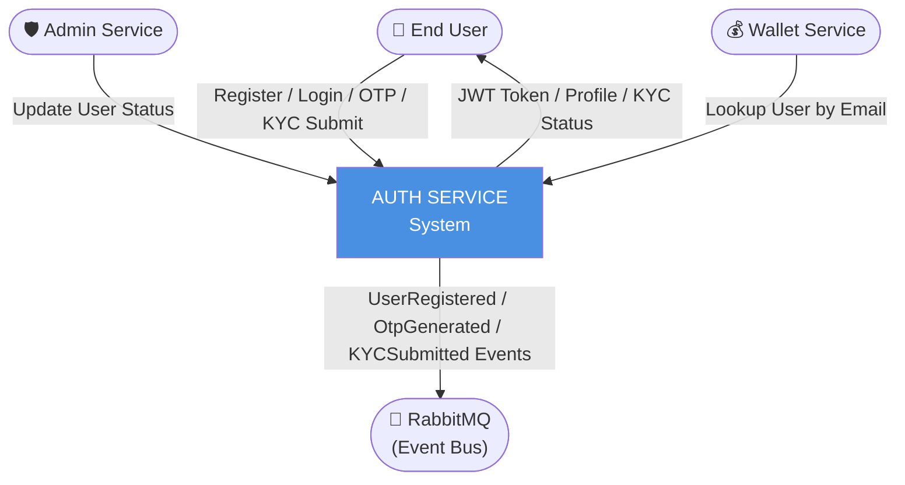

### 1.2 Detailed DFD (Level 1)

```mermaid
flowchart TD
    USER(["👤 End User"])
    ADMIN_SVC(["🛡️ Admin Service"])
    WALLET_SVC(["💰 Wallet Service"])
    RMQ(["🐇 RabbitMQ"])

    P1["P1: Register User\n(hash password, assign role)"]
    P2["P2: Login\n(verify credentials, issue JWT)"]
    P3["P3: Send OTP\n(generate code, set expiry)"]
    P4["P4: Verify OTP\n(validate code, mark used)"]
    P5["P5: Submit KYC\n(store document, set Pending)"]
    P6["P6: Get Profile\n(fetch user + KYC status)"]
    P7["P7: Update User Status\n(Pending→Active/Suspended)"]
    P8["P8: Lookup User by Email\n(resolve userId)"]
    P9["P9: Refresh Token\n(validate + rotate tokens)"]

    DS_USERS[("🗄️ Users")]
    DS_KYC[("🗄️ KYCDocuments")]
    DS_OTP[("🗄️ OTPLogs")]
    DS_RT[("🗄️ RefreshTokens")]

    USER -->|"name, email, password, phone"| P1
    P1 -->|"write user record"| DS_USERS
    P1 -->|"JWT + userId"| USER
    P1 -->|"UserRegistered event"| RMQ

    USER -->|"email, password"| P2
    P2 -->|"read credentials"| DS_USERS
    P2 -->|"write refresh token"| DS_RT
    P2 -->|"JWT + refreshToken"| USER

    USER -->|"email"| P3
    P3 -->|"write OTP + expiry"| DS_OTP
    P3 -->|"OtpGenerated event"| RMQ
    P3 -->|"OTP sent confirmation"| USER

    USER -->|"email + OTP code"| P4
    P4 -->|"read + validate OTP"| DS_OTP
    P4 -->|"mark OTP used"| DS_OTP
    P4 -->|"success/failure"| USER

    USER -->|"docType, docNumber, imageUrl"| P5
    P5 -->|"write KYC record"| DS_KYC
    P5 -->|"KYCSubmitted event"| RMQ
    P5 -->|"KYC submitted confirmation"| USER

    USER -->|"JWT (userId in claims)"| P6
    P6 -->|"read user"| DS_USERS
    P6 -->|"read KYC status"| DS_KYC
    P6 -->|"profile + KYC status"| USER

    ADMIN_SVC -->|"userId + new status"| P7
    P7 -->|"update user.Status"| DS_USERS
    P7 -->|"200 OK"| ADMIN_SVC

    WALLET_SVC -->|"email"| P8
    P8 -->|"lookup by email"| DS_USERS
    P8 -->|"userId"| WALLET_SVC

    USER -->|"refreshToken"| P9
    P9 -->|"read + validate"| DS_RT
    P9 -->|"revoke old, write new"| DS_RT
    P9 -->|"new JWT + refreshToken"| USER

    style P1 fill:#d4f4d4
    style P2 fill:#d4f4d4
    style P3 fill:#d4f4d4
    style P4 fill:#d4f4d4
    style P5 fill:#d4f4d4
    style P6 fill:#d4f4d4
    style P7 fill:#d4f4d4
    style P8 fill:#d4f4d4
    style P9 fill:#d4f4d4
    style DS_USERS fill:#dce8f5
    style DS_KYC fill:#dce8f5
    style DS_OTP fill:#dce8f5
    style DS_RT fill:#dce8f5
```

### 1.3 KYC Submission Sequence

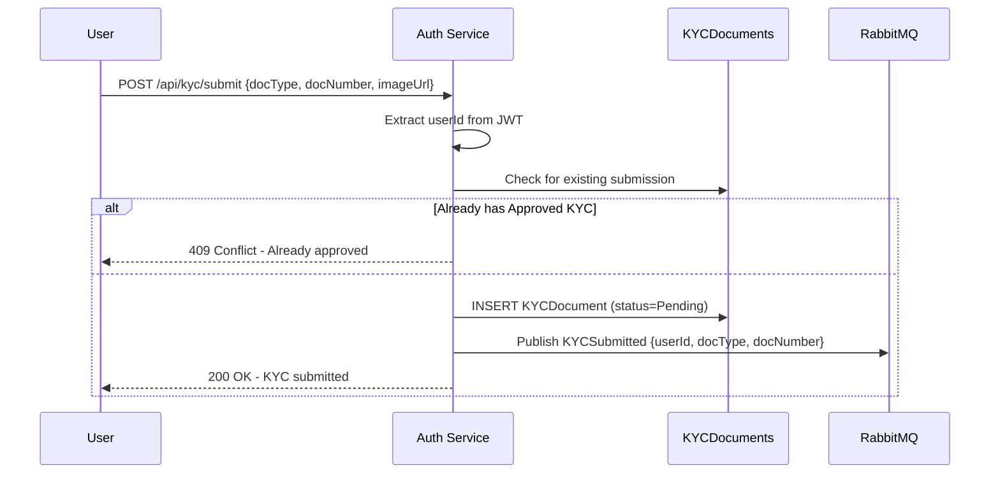

---

## 2. Wallet Service DFD

### 2.1 Context Diagram (Level 0)

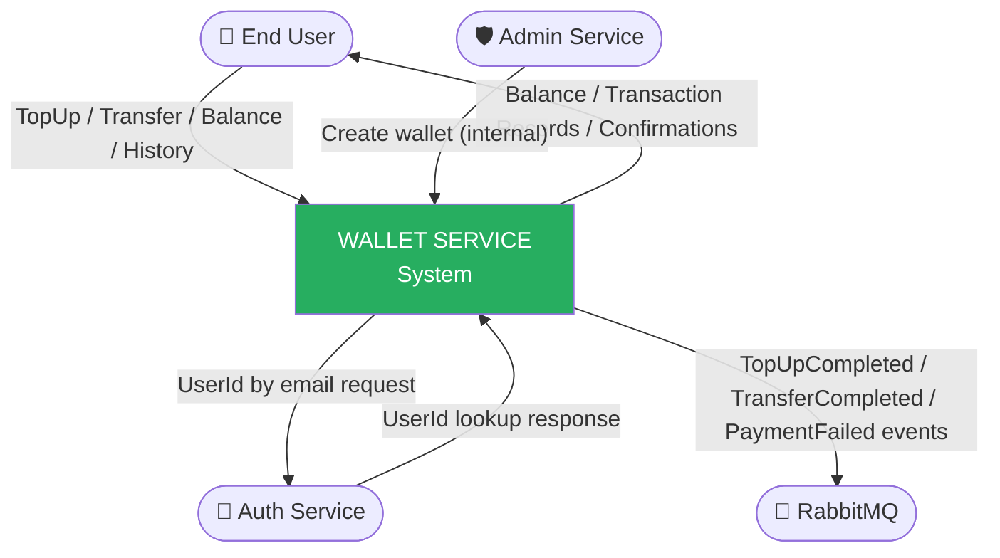

### 2.2 Detailed DFD (Level 1)

```mermaid
flowchart TD
    USER(["👤 End User"])
    AUTH_SVC(["🔐 Auth Service"])
    ADMIN_SVC(["🛡️ Admin Service"])
    RMQ(["🐇 RabbitMQ"])

    P1["P1: Create Wallet\n(assign wallet number, set limits)"]
    P2["P2: Top-Up Wallet\n(process payment, credit balance)"]
    P3["P3: Transfer Funds\n(debit sender, credit receiver)"]
    P4["P4: Get Wallet\n(fetch balance + status)"]
    P5["P5: Get Transaction History\n(paginated ledger)"]
    P6["P6: Enforce Daily Limits\n(check + update tracker)"]
    P7["P7: Resolve Recipient\n(email → userId via AuthService)"]

    DS_WALLET[("🗄️ WalletAccounts")]
    DS_LEDGER[("🗄️ LedgerEntries")]
    DS_LIMITS[("🗄️ DailyLimitTrackers")]

    ADMIN_SVC -->|"userId"| P1
    P1 -->|"write wallet record"| DS_WALLET
    P1 -->|"wallet created OK"| ADMIN_SVC

    USER -->|"amount, paymentMethod"| P2
    P2 -->|"read wallet status"| DS_WALLET
    P2 -->|"check + update"| DS_LIMITS
    P2 -->|"update balance"| DS_WALLET
    P2 -->|"write ledger entry TopUp"| DS_LEDGER
    P2 -->|"TopUpCompleted event"| RMQ
    P2 -->|"new balance"| USER

    USER -->|"recipientEmail, amount, note"| P3
    P3 -->|"recipientEmail"| P7
    P7 -->|"GET /user-by-email"| AUTH_SVC
    AUTH_SVC -->|"recipientUserId"| P7
    P7 -->|"recipientUserId"| P3
    P3 -->|"check sender balance"| DS_WALLET
    P3 -->|"check daily limit"| P6
    P6 -->|"read tracker"| DS_LIMITS
    P6 -->|"update tracker"| DS_LIMITS
    P3 -->|"debit sender wallet"| DS_WALLET
    P3 -->|"credit receiver wallet"| DS_WALLET
    P3 -->|"write TransferOut ledger"| DS_LEDGER
    P3 -->|"write TransferIn ledger"| DS_LEDGER
    P3 -->|"TransferCompleted event"| RMQ
    P3 -->|"transfer confirmation"| USER

    USER -->|"JWT userId"| P4
    P4 -->|"read wallet"| DS_WALLET
    P4 -->|"wallet + balance"| USER

    USER -->|"JWT userId, page/pageSize"| P5
    P5 -->|"read ledger"| DS_LEDGER
    P5 -->|"paginated transactions"| USER

    style P1 fill:#d4f8e8
    style P2 fill:#d4f8e8
    style P3 fill:#d4f8e8
    style P4 fill:#d4f8e8
    style P5 fill:#d4f8e8
    style P6 fill:#d4f8e8
    style P7 fill:#d4f8e8
    style DS_WALLET fill:#dce8f5
    style DS_LEDGER fill:#dce8f5
    style DS_LIMITS fill:#dce8f5
```

### 2.3 Transfer Validation Flow

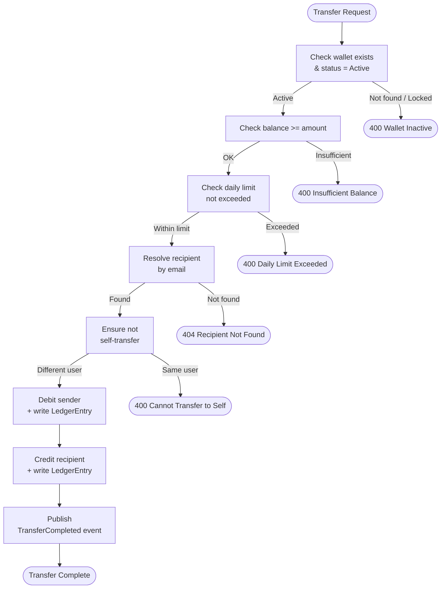

---

## 3. Rewards Service DFD

### 3.1 Context Diagram (Level 0)

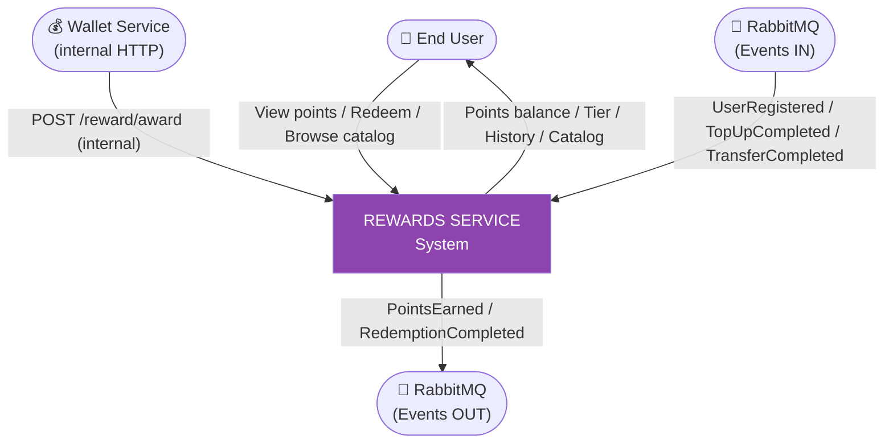

### 3.2 Detailed DFD (Level 1)

```mermaid
flowchart TD
    USER(["👤 End User"])
    ADMIN(["🛡️ Admin"])
    RMQ_IN(["🐇 RabbitMQ IN"])
    RMQ_OUT(["🐇 RabbitMQ OUT"])

    P1["P1: Initialize Rewards Account\n(on UserRegistered event)"]
    P2["P2: Award Points\n(calculate from event/request)"]
    P3["P3: Update Tier\n(check cumulative points vs thresholds)"]
    P4["P4: Get Rewards Summary\n(balance + tier + progress)"]
    P5["P5: Browse Catalog\n(list active items)"]
    P6["P6: Redeem Points\n(deduct points, create redemption)"]
    P7["P7: Manage Catalog\n(CRUD catalog items)"]
    P8["P8: Get History\n(paginated transactions)"]

    DS_ACCOUNTS[("🗄️ RewardsAccounts")]
    DS_TXNS[("🗄️ RewardsTransactions")]
    DS_CATALOG[("🗄️ RewardsCatalogItems")]
    DS_RULES[("🗄️ EarnRules")]
    DS_REDEEM[("🗄️ Redemptions")]

    RMQ_IN -->|"UserRegistered {userId}"| P1
    P1 -->|"create account (0 pts, Bronze)"| DS_ACCOUNTS

    RMQ_IN -->|"TopUpCompleted / TransferCompleted events"| P2
    P2 -->|"read earn rules"| DS_RULES
    P2 -->|"calculate points"| P2
    P2 -->|"update points balance"| DS_ACCOUNTS
    P2 -->|"write RewardsTransaction"| DS_TXNS
    P2 -->|"trigger"| P3
    P3 -->|"read total earned"| DS_ACCOUNTS
    P3 -->|"update tier if threshold crossed"| DS_ACCOUNTS
    P2 -->|"PointsEarned event"| RMQ_OUT

    USER -->|"JWT userId"| P4
    P4 -->|"read account"| DS_ACCOUNTS
    P4 -->|"points + tier + next tier progress"| USER

    USER -->|"JWT userId"| P5
    P5 -->|"read active items"| DS_CATALOG
    P5 -->|"catalog list"| USER

    USER -->|"catalogItemId"| P6
    P6 -->|"read catalog item"| DS_CATALOG
    P6 -->|"check sufficient points"| DS_ACCOUNTS
    P6 -->|"deduct points"| DS_ACCOUNTS
    P6 -->|"decrement stock"| DS_CATALOG
    P6 -->|"write Redemption"| DS_REDEEM
    P6 -->|"write RewardsTransaction (Redeem)"| DS_TXNS
    P6 -->|"RedemptionCompleted event"| RMQ_OUT
    P6 -->|"redemption confirmation"| USER

    ADMIN -->|"item details"| P7
    P7 -->|"write/update catalog"| DS_CATALOG
    P7 -->|"item created/updated"| ADMIN

    USER -->|"page/pageSize"| P8
    P8 -->|"read transactions"| DS_TXNS
    P8 -->|"paginated history"| USER

    style P1 fill:#f5e6ff
    style P2 fill:#f5e6ff
    style P3 fill:#f5e6ff
    style P4 fill:#f5e6ff
    style P5 fill:#f5e6ff
    style P6 fill:#f5e6ff
    style P7 fill:#f5e6ff
    style P8 fill:#f5e6ff
```

### 3.3 Tier Progression Flow

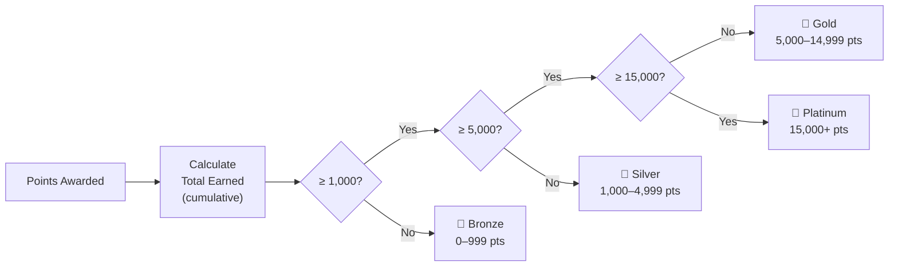

---

## 4. Notification Service DFD

### 4.1 Context Diagram (Level 0)

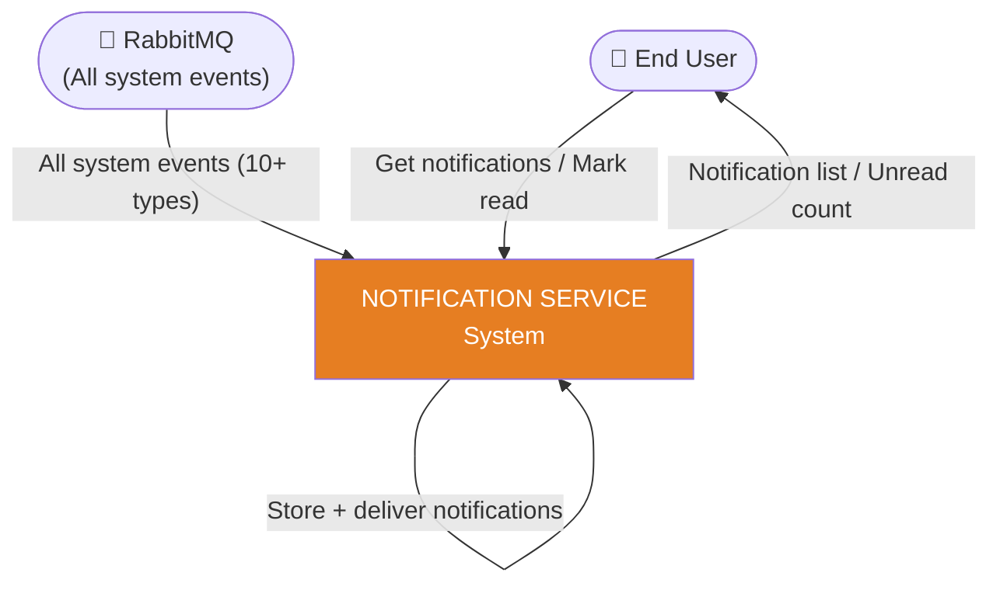

### 4.2 Detailed DFD (Level 1)

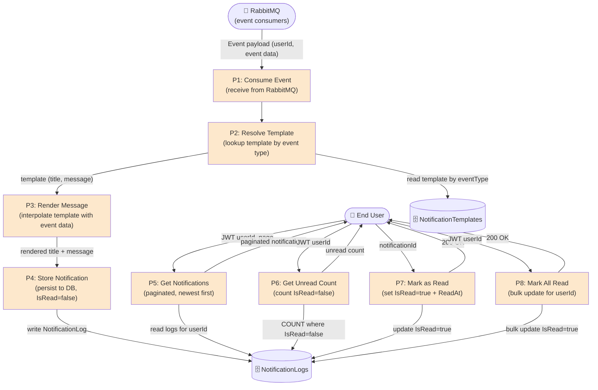

### 4.3 Event-to-Notification Mapping

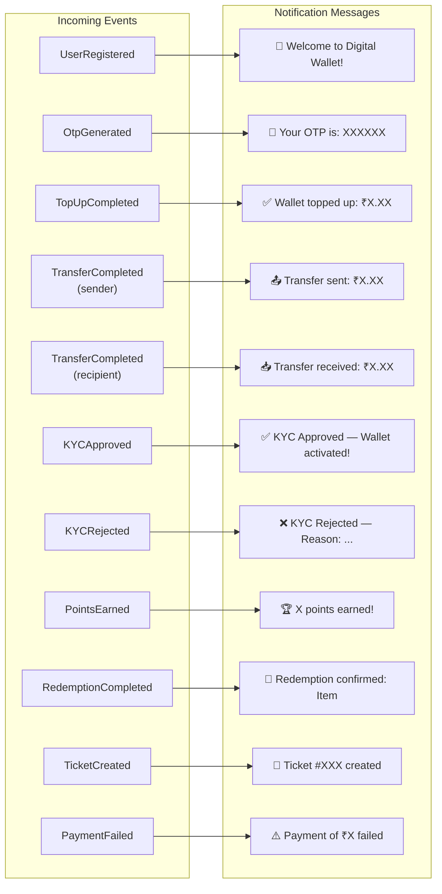

---

## 5. Admin Service DFD

### 5.1 Context Diagram (Level 0)

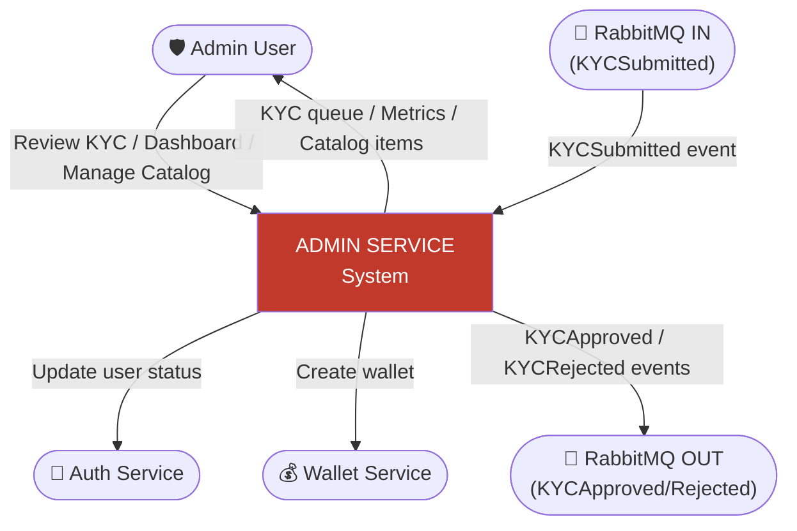

### 5.2 Detailed DFD (Level 1)

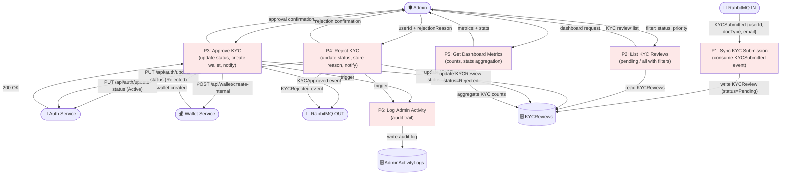

### 5.3 KYC Approval Workflow

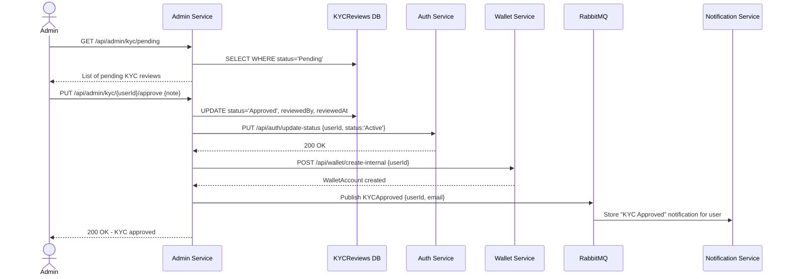

---

## 6. Support Ticket Service DFD

### 6.1 Context Diagram (Level 0)

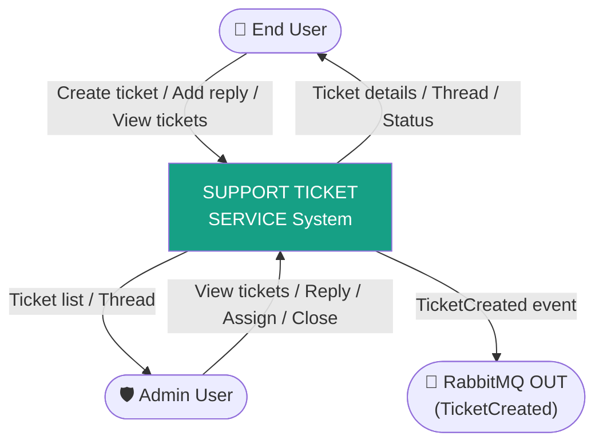

### 6.2 Detailed DFD (Level 1)

```mermaid
flowchart TD
    USER(["👤 End User"])
    ADMIN(["🛡️ Admin"])
    RMQ(["🐇 RabbitMQ"])

    P1["P1: Create Ticket\n(generate ticket number, set Open)"]
    P2["P2: List User Tickets\n(get own tickets, paginated)"]
    P3["P3: Get Ticket Detail\n(ticket + reply thread)"]
    P4["P4: Add User Reply\n(append message to thread)"]
    P5["P5: List All Tickets\n(admin: filter by status/category)"]
    P6["P6: Admin Reply\n(append admin message, set Responded)"]
    P7["P7: Assign Ticket\n(set assignedToAdminId)"]
    P8["P8: Close Ticket\n(set status=Closed)"]
    P9["P9: Generate Ticket Number\n(unique: TKT-YYYYMMDD-XXXX)"]

    DS_TICKETS[("🗄️ SupportTickets")]
    DS_REPLIES[("🗄️ TicketReplies")]

    USER -->|"subject, message, category"| P1
    P1 -->|"generate number"| P9
    P9 -->|"unique ticketNumber"| P1
    P1 -->|"write SupportTicket"| DS_TICKETS
    P1 -->|"TicketCreated event"| RMQ
    P1 -->|"ticket created + ticketId"| USER

    USER -->|"JWT userId, page"| P2
    P2 -->|"read tickets WHERE userId"| DS_TICKETS
    P2 -->|"own ticket list"| USER

    USER -->|"ticketId"| P3
    P3 -->|"read ticket"| DS_TICKETS
    P3 -->|"read replies"| DS_REPLIES
    P3 -->|"ticket + thread"| USER

    USER -->|"ticketId + message"| P4
    P4 -->|"write TicketReply (isAdmin=false)"| DS_REPLIES
    P4 -->|"update ticket.Status=InProgress"| DS_TICKETS
    P4 -->|"200 OK"| USER

    ADMIN -->|"status/category filters, page"| P5
    P5 -->|"read all tickets with filters"| DS_TICKETS
    P5 -->|"ticket list"| ADMIN

    ADMIN -->|"ticketId + message"| P6
    P6 -->|"write TicketReply (isAdmin=true)"| DS_REPLIES
    P6 -->|"update ticket.Status=Responded"| DS_TICKETS
    P6 -->|"200 OK"| ADMIN

    ADMIN -->|"ticketId + adminId"| P7
    P7 -->|"update assignedToAdminId"| DS_TICKETS
    P7 -->|"200 OK"| ADMIN

    ADMIN -->|"ticketId"| P8
    P8 -->|"update status=Closed"| DS_TICKETS
    P8 -->|"200 OK"| ADMIN

    style P1 fill:#d4f0ec
    style P2 fill:#d4f0ec
    style P3 fill:#d4f0ec
    style P4 fill:#d4f0ec
    style P5 fill:#d4f0ec
    style P6 fill:#d4f0ec
    style P7 fill:#d4f0ec
    style P8 fill:#d4f0ec
    style P9 fill:#d4f0ec
```

### 6.3 Ticket Lifecycle State Machine

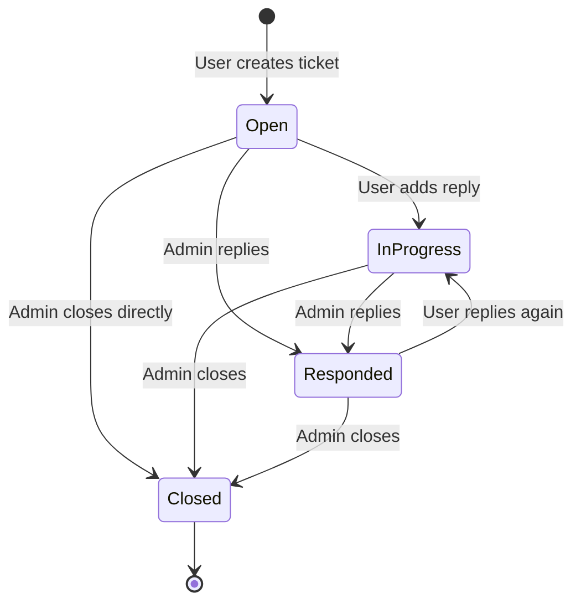

---

## 7. Cross-Service Event Flow Summary

Complete picture of how all services interact through events:

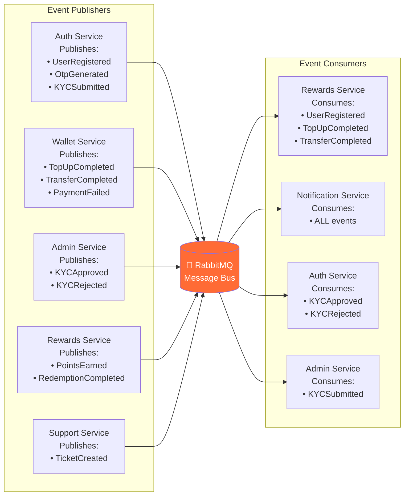
